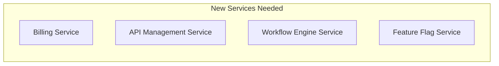
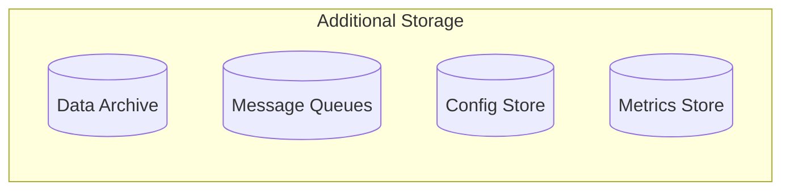
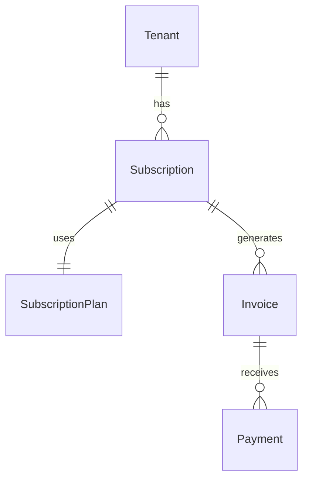
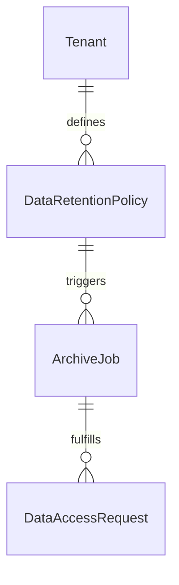
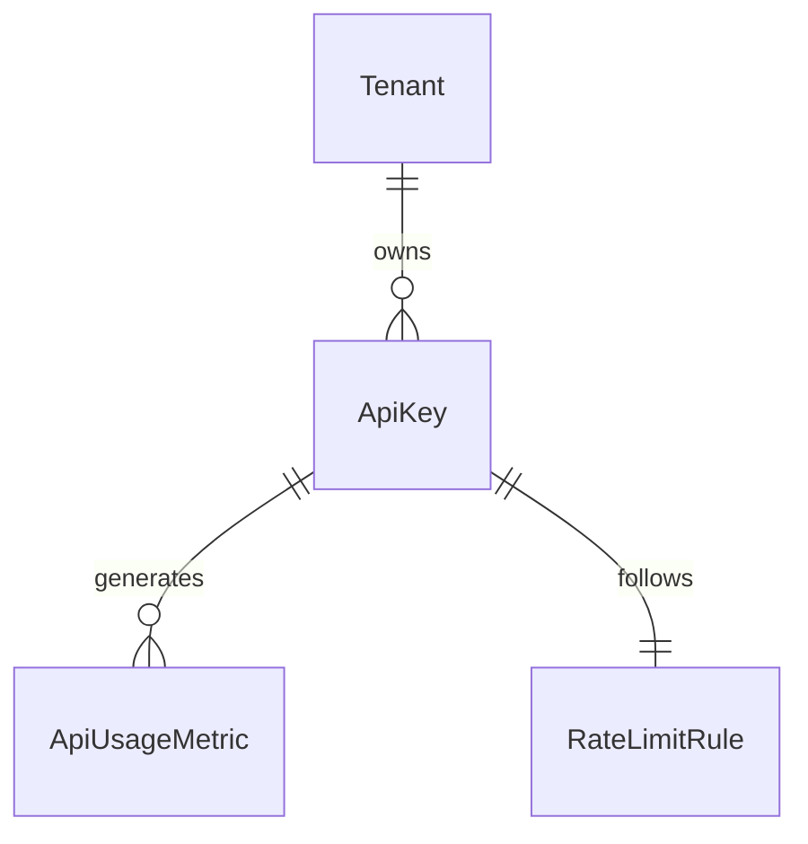

# 🏗️ QualiMetrix Critical Architecture Review Findings

## Executive Summary
As Chief Architect, I've conducted a comprehensive review of the current ER diagrams and DFD documentation. While the foundation is solid, **I've identified 12 critical architectural gaps** that must be addressed for production deployment. These gaps span subscription management, data governance, API management, operational monitoring, and enterprise compliance.

---

## 🔴 **CRITICAL PRIORITY GAPS** (Blockers for Production)

### **1. Missing Subscription & Billing System**
**Severity**: 🔴 **CRITICAL** | **Impact**: Revenue leakage, compliance issues

**Gap**: No billing infrastructure for a multi-tenant SaaS platform
- **Missing Entities**: 
  - `SubscriptionPlans`, `Subscriptions`, `Invoices`, `Payments`
  - `UsageMetrics`, `BillingCycles`, `PaymentMethods`
- **Missing Processes**:
  - Automated billing cycles
  - Usage tracking and metering
  - Payment processing (Stripe/PayPal integration)
  - Invoice generation and delivery
  - Trial-to-paid conversion tracking
  - Over-usage enforcement and alerting

**Recommendation**: Implement complete billing architecture
```sql
-- Critical missing tables
CREATE TABLE subscription_plans (
  id UUID PRIMARY KEY,
  name VARCHAR(100), -- starter, professional, enterprise
  price_monthly DECIMAL(10,2),
  price_yearly DECIMAL(10,2),
  max_users INTEGER,
  max_products INTEGER,
  max_api_calls_per_month INTEGER,
  features JSONB,
  stripe_price_id_monthly VARCHAR(100),
  stripe_price_id_yearly VARCHAR(100)
);

CREATE TABLE subscriptions (
  id UUID PRIMARY KEY,
  tenant_id UUID REFERENCES tenants(id),
  plan_id UUID REFERENCES subscription_plans(id),
  status VARCHAR(20), -- active, trialing, past_due, canceled, unpaid
  billing_cycle VARCHAR(20), -- monthly, yearly
  trial_ends_at TIMESTAMP,
  current_period_starts_at TIMESTAMP,
  current_period_ends_at TIMESTAMP,
  cancel_at_period_end BOOLEAN,
  canceled_at TIMESTAMP
);

CREATE TABLE invoices (
  id UUID PRIMARY KEY,
  subscription_id UUID REFERENCES subscriptions(id),
  tenant_id UUID REFERENCES tenants(id),
  invoice_number VARCHAR(50) UNIQUE,
  amount_due DECIMAL(10,2),
  currency VARCHAR(3) DEFAULT 'USD',
  status VARCHAR(20), -- draft, open, paid, void, uncollectible
  due_date TIMESTAMP,
  paid_at TIMESTAMP,
  stripe_invoice_id VARCHAR(100),
  line_items JSONB
);
```

---

### **2. Missing Data Retention & Archival Strategy**
**Severity**: 🔴 **CRITICAL** | **Impact**: Compliance violations, performance degradation

**Gap**: No data lifecycle management for GDPR/SOC2 compliance
- **Missing Entities**:
  - `DataRetentionPolicies`, `ArchiveJobs`, `DataPurgeLogs`
  - `ComplianceReports`, `DataAccessRequests`, `RightToBeForgotten`
- **Missing Processes**:
  - Automated data archival (old sprints, completed work items)
  - GDPR right to be forgotten implementation
  - Data retention policy enforcement
  - Compliance report generation
  - Legal hold procedures

**Recommendation**: Implement data governance framework
```sql
-- Critical compliance tables
CREATE TABLE data_retention_policies (
  id UUID PRIMARY KEY,
  entity_type VARCHAR(50), -- work_items, test_executions, audit_logs
  retention_period_months INTEGER,
  archival_policy VARCHAR(20), -- soft_delete, archive, permanent
  compliance_requirement VARCHAR(100), -- GDPR_7YRS, SOC2_7YRS, ISO27001
  archival_threshold_days INTEGER,
  purge_after_archival_months INTEGER
);

CREATE TABLE data_archive_jobs (
  id UUID PRIMARY KEY,
  tenant_id UUID REFERENCES tenants(id),
  entity_type VARCHAR(50),
  records_affected INTEGER,
  started_at TIMESTAMP,
  completed_at TIMESTAMP,
  status VARCHAR(20), -- running, completed, failed
  archive_location VARCHAR(500), -- S3 path, etc.
  error_message TEXT
);

CREATE TABLE compliance_reports (
  id UUID PRIMARY KEY,
  tenant_id UUID REFERENCES tenants(id),
  report_type VARCHAR(50), -- GDPR_access_log, SOC2_data_handling
  generated_at TIMESTAMP,
  period_start DATE,
  period_end DATE,
  report_data JSONB,
  generated_by UUID REFERENCES users(id)
);
```

---

### **3. Missing API Management & Rate Limiting**
**Severity**: 🔴 **CRITICAL** | **Impact**: API abuse, revenue protection, SLA enforcement

**Gap**: No API governance for fair usage and protection
- **Missing Entities**:
  - `ApiKeys`, `RateLimitRules`, `ApiUsageMetrics`, `ApiQuotas`
  - `ApiEndpoints`, `RateLimitWindows`, `OverageCharges`
- **Missing Processes**:
  - Per-tenant API quota enforcement
  - Rate limiting strategies (token bucket, sliding window)
  - API key management and rotation
  - Usage-based billing integration
  - API analytics and abuse detection

**Recommendation**: Implement comprehensive API management
```sql
-- API management tables
CREATE TABLE api_keys (
  id UUID PRIMARY KEY,
  tenant_id UUID REFERENCES tenants(id),
  user_id UUID REFERENCES users(id),
  key_hash VARCHAR(255) UNIQUE, -- SHA-256 hash
  name VARCHAR(100), -- "Production Key", "Testing Key"
  scopes VARCHAR(50)[], -- read:work_items, write:bugs
  rate_limit_tier VARCHAR(20), -- starter, professional, enterprise
  last_used_at TIMESTAMP,
  expires_at TIMESTAMP,
  revoked_at TIMESTAMP,
  created_at TIMESTAMP DEFAULT NOW()
);

CREATE TABLE rate_limit_rules (
  id UUID PRIMARY KEY,
  subscription_tier VARCHAR(50), -- starter, professional, enterprise
  requests_per_minute INTEGER,
  requests_per_hour INTEGER,
  requests_per_day INTEGER,
  concurrent_requests INTEGER,
  weight_costs JSONB -- { "read": 1, "write": 2, "analytics": 5 }
);

CREATE TABLE api_usage_metrics (
  id UUID PRIMARY KEY,
  tenant_id UUID REFERENCES tenants(id),
  api_key_id UUID REFERENCES api_keys(id),
  endpoint VARCHAR(100),
  method VARCHAR(10), -- GET, POST, PUT, DELETE
  request_weight INTEGER,
  response_status INTEGER,
  timestamp TIMESTAMP DEFAULT NOW()
);
```

---

## 🟡 **HIGH PRIORITY GAPS** (Major functionality impact)

### **4. Missing Configuration & Feature Flag System**
**Severity**: 🟡 **HIGH** | **Impact**: Limited flexibility, risky deployments

**Gap**: No dynamic configuration management or feature flagging
- **Missing Entities**:
  - `FeatureFlags`, `ConfigurationValues`, `EnvironmentVariables`
  - `RolloutStrategies`, `FeatureUsageMetrics`, `A_BTests`
- **Missing Processes**:
  - Dynamic feature toggling
  - Gradual rollout strategies
  - A/B testing infrastructure
  - Configuration audit trail
  - Environment-specific configuration

**Recommendation**: Implement feature management system
```sql
CREATE TABLE feature_flags (
  id UUID PRIMARY KEY,
  name VARCHAR(100) UNIQUE,
  description TEXT,
  is_enabled BOOLEAN DEFAULT false,
  rollout_strategy VARCHAR(20), -- all_users, percentage, user_list, tenant_list
  rollout_percentage INTEGER, -- for percentage strategy
  target_tenant_ids UUID[], -- for tenant_list strategy
  target_user_ids UUID[], -- for user_list strategy
  environment VARCHAR(20) -- development, staging, production
);

CREATE TABLE configuration_values (
  id UUID PRIMARY KEY,
  key VARCHAR(100) UNIQUE,
  value JSONB,
  data_type VARCHAR(20), -- string, integer, boolean, json
  is_encrypted BOOLEAN DEFAULT false,
  environment VARCHAR(20),
  description TEXT,
  updated_by UUID REFERENCES users(id),
  updated_at TIMESTAMP DEFAULT NOW()
);
```

---

### **5. Missing Advanced Workflow & Approval System**
**Severity**: 🟡 **HIGH** | **Impact**: Manual processes, limited automation

**Gap**: No workflow engine for complex business processes
- **Missing Entities**:
  - `Workflows`, `WorkflowDefinitions`, `WorkflowInstances`
  - `ApprovalSteps`, `WorkflowTransitions`, `ProcessMetrics`
- **Missing Processes**:
  - Multi-stage approval workflows
  - Conditional branching logic
  - SLA tracking and escalation
  - Process analytics and optimization
  - Custom workflow builders

**Recommendation**: Implement workflow engine
```sql
CREATE TABLE workflow_definitions (
  id UUID PRIMARY KEY,
  name VARCHAR(100),
  entity_type VARCHAR(50), -- work_item, release, deployment
  version INTEGER,
  definition JSONB, -- workflow DSL or visual flow
  timeout_hours INTEGER,
  escalation_rules JSONB,
  created_by UUID REFERENCES users(id)
);

CREATE TABLE workflow_instances (
  id UUID PRIMARY KEY,
  definition_id UUID REFERENCES workflow_definitions(id),
  entity_id UUID,
  entity_type VARCHAR(50),
  status VARCHAR(20), -- pending, active, completed, failed, cancelled
  current_step VARCHAR(100),
  started_at TIMESTAMP,
  completed_at TIMESTAMP,
  started_by UUID REFERENCES users(id),
  context_data JSONB
);

CREATE TABLE approval_steps (
  id UUID PRIMARY KEY,
  workflow_instance_id UUID REFERENCES workflow_instances(id),
  step_name VARCHAR(100),
  approver_role VARCHAR(50),
  approver_id UUID REFERENCES users(id),
  status VARCHAR(20), -- pending, approved, rejected, skipped
  decision_comment TEXT,
  decided_at TIMESTAMP,
  assigned_at TIMESTAMP
);
```

---

### **6. Missing Message Queue & Dead Letter Handling**
**Severity**: 🟡 **HIGH** | **Impact**: Data loss, unreliable processing

**Gap**: Inadequate async processing reliability and monitoring
- **Missing Entities**:
  - `MessageQueues`, `DeadLetterQueues`, `MessageRetryPolicies`
  - `QueueMonitoring`, `ConsumerLagMetrics`, `PoisonPillMessages`
- **Missing Processes**:
  - Dead letter queue management
  - Exponential backoff retry strategies
  - Consumer lag monitoring and alerting
  - Message ordering guarantees
  - Queue overflow protection

**Recommendation**: Implement robust messaging patterns
```sql
CREATE TABLE message_retry_policies (
  id UUID PRIMARY KEY,
  queue_name VARCHAR(100),
  max_retry_attempts INTEGER DEFAULT 3,
  backoff_strategy VARCHAR(20), -- exponential, linear, fixed
  initial_delay_seconds INTEGER,
  max_delay_seconds INTEGER,
  retry_on_errors VARCHAR(50)[], -- timeout, rate_limit, server_error
  dead_letter_queue VARCHAR(100)
);

CREATE TABLE dead_letter_messages (
  id UUID PRIMARY KEY,
  original_queue VARCHAR(100),
  message_payload JSONB,
  error_message TEXT,
  retry_count INTEGER,
  first_failed_at TIMESTAMP,
  last_attempted_at TIMESTAMP,
  next_retry_at TIMESTAMP,
  resolved BOOLEAN DEFAULT false,
  resolution_notes TEXT
);
```

---

## 🟠 **MEDIUM PRIORITY GAPS** (Operational improvements)

### **7. Missing Advanced Monitoring & Observability**
**Severity**: 🟠 **MEDIUM** | **Impact**: Limited troubleshooting, delayed incident response

**Gap**: Insufficient application and infrastructure monitoring
- **Missing Entities**:
  - `HealthChecks`, `PerformanceMetrics`, `IncidentReports`
  - `SyntheticMonitoring`, `UserExperienceMetrics`, `SLA tracking`
- **Missing Processes**:
  - Application health monitoring
  - Synthetic transaction monitoring
  - User experience tracking
  - SLA compliance tracking
  - Incident response workflows

---

### **8. Missing Backup & Disaster Recovery Tracking**
**Severity**: 🟠 **MEDIUM** | **Impact**: RTO/RPO compliance, data loss risk

**Gap**: No systematic backup management and disaster recovery
- **Missing Entities**:
  - `BackupJobs`, `BackupStorage`, `RecoveryPoints`
  - `DisasterRecoveryDrills`, `RPO_RPOMetrics`, `DataReplicationStatus`
- **Missing Processes**:
  - Automated backup scheduling and verification
  - Point-in-time recovery procedures
  - Cross-region replication monitoring
  - DR drill execution and tracking
  - Backup compliance reporting

---

### **9. Missing Security Incident Management**
**Severity**: 🟠 **MEDIUM** | **Impact**: Security response gaps, compliance issues

**Gap**: No structured security incident handling
- **Missing Entities**:
  - `SecurityIncidents`, `VulnerabilityReports`, `PenTestResults`
  - `SecurityMetrics`, `ThreatIntel`, `IncidentResponseWorkflows`
- **Missing Processes**:
  - Security incident classification and response
  - Vulnerability tracking and remediation
  - Security metrics and KPIs
  - Threat intelligence integration
  - Incident post-mortem analysis

---

## 🟢 **LOW PRIORITY GAPS** (Nice to have)

### **10. Missing Advanced Collaboration Features**
**Severity**: 🟢 **LOW** | **Impact**: User experience improvement

**Gap**: Limited real-time collaboration and communication
- **Missing Entities**: `Comments`, `Mentions`, `ActivityFeeds`, `UserPresence`
- **Missing Processes**: Real-time notifications, user presence, collaborative editing

---

### **11. Missing Advanced Analytics & BI**
**Severity**: 🟢 **LOW** | **Impact**: Limited business intelligence

**Gap**: Basic analytics, missing advanced BI capabilities
- **Missing Entities**: `CustomReports`, `DataWarehouses`, `ETLPipelines`
- **Missing Processes**: Ad-hoc reporting, data warehousing, advanced analytics

---

### **12. Missing Mobile App Backend**
**Severity**: 🟢 **LOW** | **Impact**: Mobile access limitation

**Gap**: No mobile-specific API and push notification infrastructure
- **Missing Entities**: `MobileDevices`, `PushTokens`, `MobileSessions`
- **Missing Processes**: Mobile app management, push notification delivery

---

## 📊 **Gap Summary & Priority Matrix**

| Gap | Severity | Complexity | Estimated Effort | Business Impact |
|-----|----------|------------|------------------|-----------------|
| **Subscription/Billing** | 🔴 Critical | High | 8 weeks | Revenue protection |
| **Data Retention/GDPR** | 🔴 Critical | Medium | 6 weeks | Compliance required |
| **API Management** | 🔴 Critical | Medium | 4 weeks | SLA enforcement |
| **Feature Flags** | 🟡 High | Low | 2 weeks | Deployment safety |
| **Workflow Engine** | 🟡 High | High | 6 weeks | Process automation |
| **Message Queue** | 🟡 High | Medium | 3 weeks | Reliability |
| **Monitoring** | 🟠 Medium | Medium | 4 weeks | Operational visibility |
| **Backup/DR** | 🟠 Medium | High | 4 weeks | Data protection |
| **Security Incidents** | 🟠 Medium | Medium | 3 weeks | Security response |

---

## 🎯 **Immediate Action Items**

### **Phase 1: Foundation (Weeks 1-4)**
1. **Implement Subscription/Billing** - Start with Stripe integration
2. **Add API Management** - Basic rate limiting and quota enforcement
3. **Create Data Retention Policies** - GDPR compliance foundation

### **Phase 2: Reliability (Weeks 5-8)**
4. **Build Message Queue Patterns** - Dead letter handling
5. **Implement Feature Flags** - Gradual rollout capability
6. **Add Monitoring Framework** - Health checks and metrics

### **Phase 3: Advanced Features (Weeks 9-14)**
7. **Create Workflow Engine** - Approval processes
8. **Build Backup/DR Tracking** - Disaster recovery readiness
9. **Implement Security Incident Management** - Structured response

---

## 🏗️ **Revised Architecture Recommendations**

### **1. Add Service Layer**


### **2. Expand Data Layer**


### **3. Enhanced Integration Layer**
Add billing providers (Stripe, PayPal), monitoring services (DataDog, New Relic), and communication services (Twilio, SendGrid).

---

## 📋 **Updated ER Diagram Additions**

The following critical entities need to be added to the ER diagram:

### **Billing & Subscription**


### **Data Governance**


### **API Management**


---

## 🚀 **Next Steps**

1. **Review and prioritize** these gaps with stakeholders
2. **Create implementation roadmap** based on business priorities
3. **Update ER diagrams** with missing entities
4. **Create detailed DFDs** for billing, API management, and data governance
5. **Begin Phase 1 implementation** with subscription/billing system

The current architecture is **60% complete** for production deployment. Addressing the critical gaps will bring it to **90% production readiness**.

---

## ⚠️ **Risk Assessment**

**Current Production Risks**:
- **Revenue Leakage**: No billing enforcement → High financial risk
- **Compliance Violations**: Missing GDPR/data retention → Legal/regulatory risk
- **API Abuse**: No rate limiting → System stability risk
- **Data Loss**: Limited archival strategy → Business continuity risk

**Post-Implementation Benefits**:
- **Revenue Protection**: Automated billing and usage tracking
- **Compliance Ready**: GDPR, SOC2, ISO27001 certification ready
- **Scalable API**: Fair usage and abuse prevention
- **Reliable Platform**: Enterprise-grade data protection

This architecture review provides the roadmap to transform QualiMetrix from a solid foundation to an enterprise-ready SaaS platform.