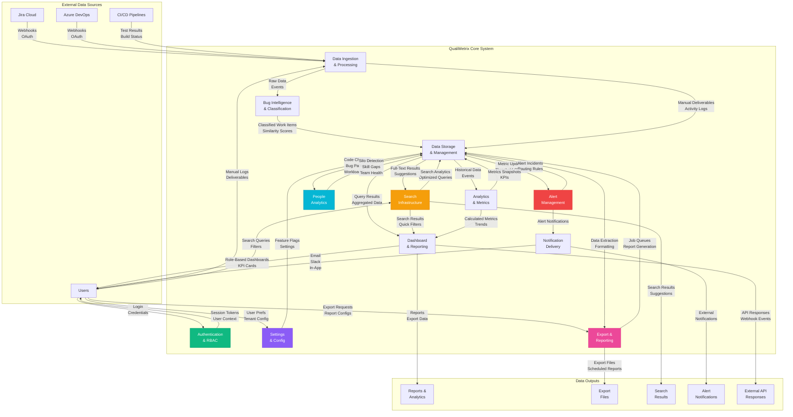
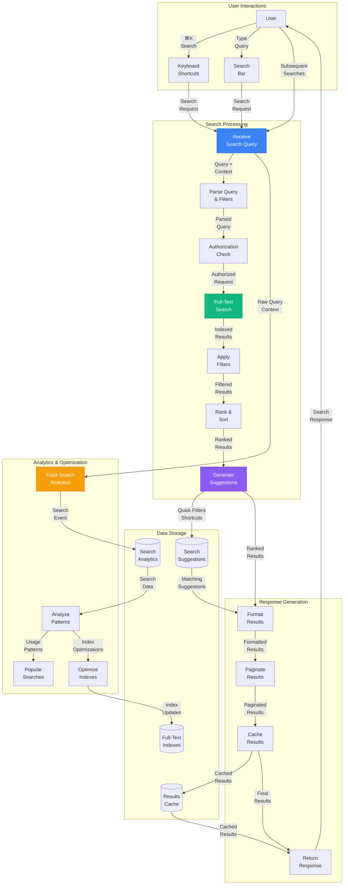
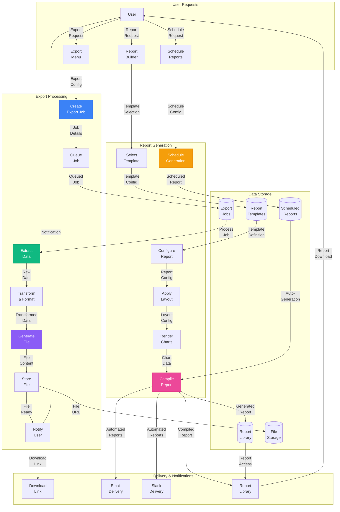
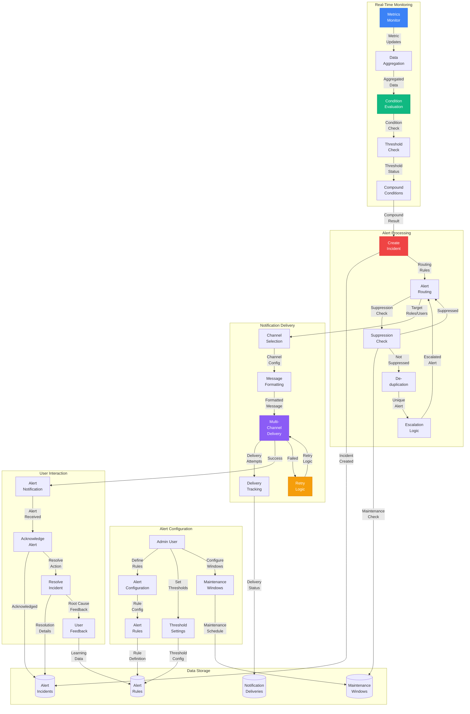
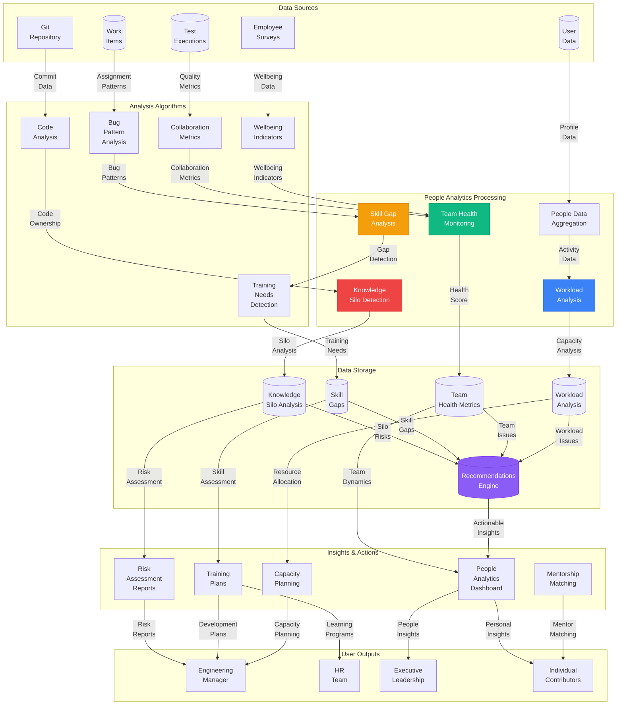
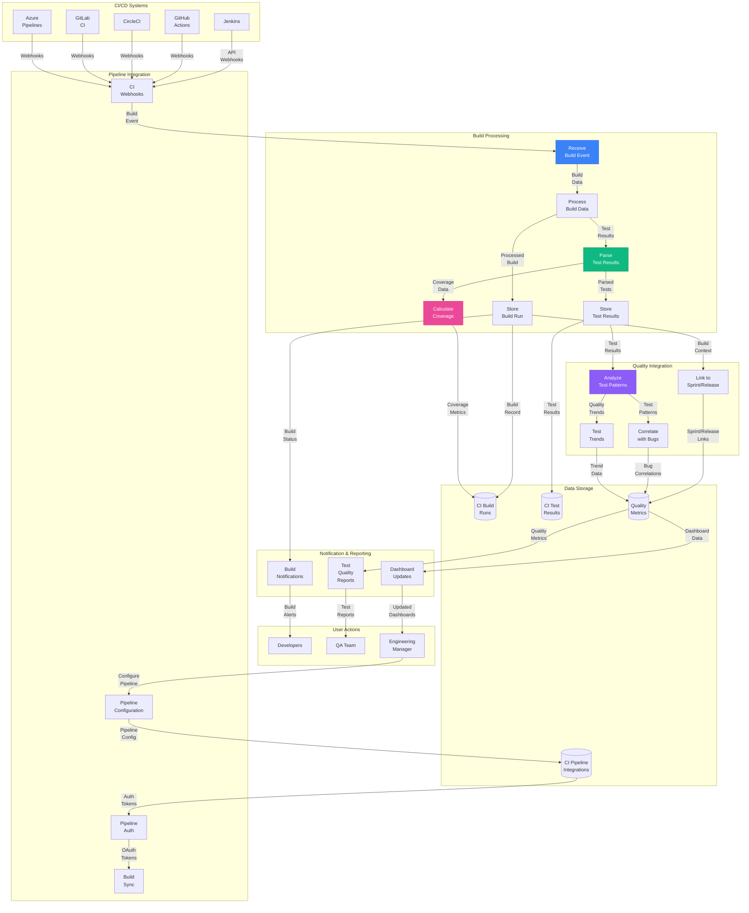
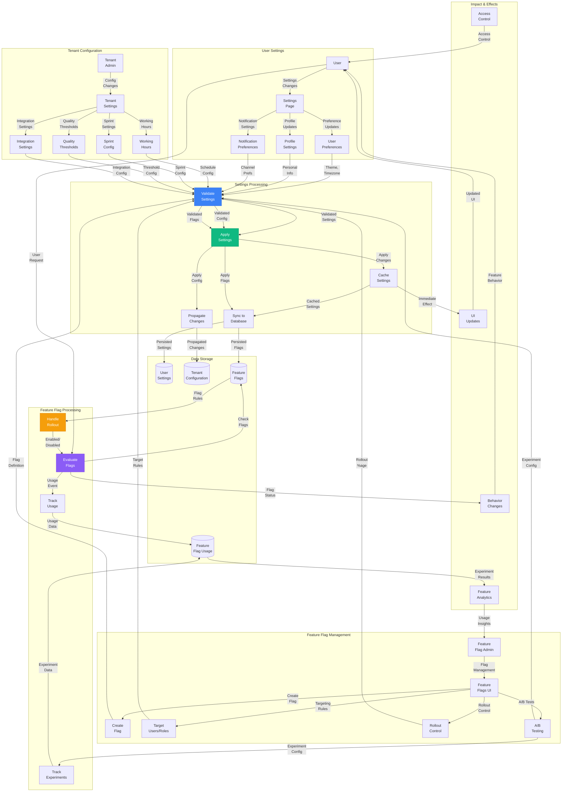

# QualiMetrix Data Flow Diagrams (Updated & Complete)

## System Overview
Comprehensive data flow documentation for QualiMetrix showing **all** system processes, including new search, export, alert, CI/CD, and people analytics flows.

---

## Level 0: Context Diagram (Updated)

```mermaid
graph TB
    subgraph "External Systems"
        JIRA[Jira Cloud]
        ADO[Azure DevOps]
        GITHUB[GitHub]
        CI[CI/CD Pipelines]
        EMAIL[Email Service]
        SLACK[Slack API]
    end
    
    subgraph "Users"
        ADMIN[Admin User]
        TESTER[Tester]
        DEVELOPER[Developer]
        PO[Product Owner]
        EXEC[Executive]
    end
    
    QUALIMETRIX[QualiMetrix System]
    
    %% Data Flows from External Systems
    JIRA -- "OAuth 2.0<br/>Webhooks<br/>REST API" --> QUALIMETRIX
    ADO -- "OAuth 2.0<br/>Webhooks<br/>REST API" --> QUALIMETRIX
    GITHUB -- "Webhooks<br/>API Integration" --> QUALIMETRIX
    CI -- "JUnit XML<br/>Test Results<br/>Build Status" --> QUALIMETRIX
    
    %% Data Flows to External Systems
    QUALIMETRIX -- "Alert Notifications<br/>Report Emails" --> EMAIL
    QUALIMETRIX -- "Team Updates<br/>Alert Notifications" --> SLACK
    
    %% Data Flows from Users
    ADMIN -- "RBAC Management<br/>Alert Config<br/>Export Requests" --> QUALIMETRIX
    TESTER -- "Manual Test Logs<br/>Bug Reports<br/>Search Queries" --> QUALIMETRIX
    DEVELOPER -- "Bug Updates<br/>Status Changes<br/>Settings Prefs" --> QUALIMETRIX
    PO -- "Requirements<br/>Report Generation<br/>Release Planning" --> QUALIMETRIX
    EXEC -- "Portfolio Analytics<br/>People Insights<br/>Strategic Reports" --> QUALIMETRIX
    
    %% Data Flows to Users
    QUALIMETRIX -- "Quality Dashboards<br/>Search Results<br/>Export Files" --> ADMIN
    QUALIMETRIX -- "Test Execution<br/>Defect Metrics<br/>Assignments" --> TESTER
    QUALIMETRIX -- "Bug Intelligence<br/>CI Results<br/>Performance Stats" --> DEVELOPER
    QUALIMETRIX -- "Release Readiness<br/>RTM Reports<br/>Scheduled Reports" --> PO
    QUALIMETRIX -- "Team Health<br/>People Analytics<br/>ROI Analytics" --> EXEC
    
    style QUALIMETRIX fill:#0ea5e9,stroke:#0369a1,color:#fff
    style JIRA fill:#0052cc,stroke:#003d99,color:#fff
    style ADO fill:#0078d4,stroke:#005a9e,color:#fff
    style GITHUB fill:#24292e,stroke:#1b1f23,color:#fff
    style CI fill:#ff6b6b,stroke:#c92a2a,color:#fff
    style EMAIL fill:#f59e0b,stroke:#d97706,color:#fff
    style SLACK fill:#4a154b,stroke:#361134,color:#fff
```

---

## Level 1: Main System Processes (Updated)

---

## 🆕 Level 2A: Search Infrastructure Flow

### **Search Infrastructure Flow Details**

#### **Query Processing**
1. **Input Reception**: Receive search queries from keyboard shortcuts (⌘K) or search bar
2. **Query Parsing**: Extract search terms, filters, and scope (bugs, people, stories)
3. **Authorization Check**: Verify user permissions for searched entities
4. **Full-Text Search**: Query PostgreSQL full-text indexes with TF-IDF ranking

#### **Results Processing**
1. **Filter Application**: Apply role-based, product-based, and custom filters
2. **Ranking & Sorting**: Rank by relevance, date, priority, or custom criteria
3. **Suggestion Enhancement**: Add admin-configured suggestions and shortcuts
4. **Response Formatting**: Format results for UI display with pagination

#### **Analytics & Optimization**
1. **Search Tracking**: Log all searches with results, clicks, and timing
2. **Pattern Analysis**: Identify popular searches and zero-result queries
3. **Index Optimization**: Update indexes based on search patterns
4. **Caching Strategy**: Cache common searches and result sets

---

## 🆕 Level 2B: Export & Reporting Flow

### **Export & Reporting Flow Details**

#### **Export Processing**
1. **Job Creation**: Create export job with user config, filters, and format
2. **Queue Management**: Prioritize jobs based on size and user role
3. **Data Extraction**: Query database with appropriate filters and scopes
4. **Transformation**: Convert data to target format (CSV, JSON, PDF, Excel)
5. **File Generation**: Generate file with appropriate formatting and metadata
6. **Storage & Delivery**: Store file with expiration and notify user

#### **Report Generation**
1. **Template Selection**: Choose from standard, custom, or ad-hoc templates
2. **Configuration**: Define data sources, filters, layout, and styling
3. **Chart Rendering**: Generate visualizations from metrics data
4. **Report Compilation**: Combine charts, tables, and text into final report
5. **Library Storage**: Archive reports with retention policies

#### **Scheduling & Automation**
1. **Schedule Configuration**: Define cron expressions and delivery methods
2. **Automated Generation**: Background processing at scheduled times
3. **Multi-Channel Delivery**: Email, Slack, and library storage
4. **Error Handling**: Retry failed deliveries and alert administrators

---

## 🆕 Level 2C: Alert Management Flow

### **Alert Management Flow Details**

#### **Alert Configuration**
1. **Rule Definition**: Configure metric types, operators, thresholds, and conditions
2. **Compound Conditions**: Combine multiple metrics with AND/OR logic
3. **Targeting Rules**: Define roles, users, and products for alert scope
4. **Maintenance Windows**: Configure suppression periods for planned downtime
5. **Notification Channels**: Set up email, Slack, and in-app delivery methods

#### **Real-Time Monitoring**
1. **Metrics Monitoring**: Continuously monitor metric values from quality snapshots
2. **Data Aggregation**: Aggregate metrics by time window and scope
3. **Condition Evaluation**: Check if thresholds are exceeded or conditions met
4. **Compound Logic**: Evaluate complex conditions with multiple metrics

#### **Alert Processing**
1. **Incident Creation**: Create alert incidents when conditions are triggered
2. **Suppression Check**: Verify if maintenance windows or cooldowns apply
3. **Deduplication**: Prevent duplicate alerts for same condition
4. **Escalation Logic**: Apply escalation rules based on time and severity

#### **Notification Delivery**
1. **Channel Selection**: Choose appropriate channels based on severity and config
2. **Message Formatting**: Apply templates with dynamic data insertion
3. **Multi-Channel Delivery**: Send to email, Slack, and in-app simultaneously
4. **Delivery Tracking**: Monitor delivery status and retry failures
5. **User Interaction**: Handle acknowledgments, resolutions, and feedback

---

## 🆕 Level 2D: People Analytics Flow

### **People Analytics Flow Details**

#### **Knowledge Silo Detection**
1. **Code Analysis**: Analyze Git commits for code ownership patterns
2. **Ownership Calculation**: Determine primary, secondary, and tertiary contributors
3. **Bus Factor Analysis**: Calculate minimum people needed before knowledge loss
4. **Risk Assessment**: Identify critical silos with high bus factor risk
5. **Mitigation Recommendations**: Suggest documentation, mentorship, and training

#### **Skill Gap Analysis**
1. **Bug Pattern Analysis**: Identify skill gaps from bug patterns and failures
2. **Performance Assessment**: Analyze code reviews, test failures, and incidents
3. **Gap Classification**: Categorize gaps by skill area and severity level
4. **Training Recommendations**: Suggest specific training resources and programs
5. **Development Planning**: Create individual development plans with timelines

#### **Team Health Monitoring**
1. **Collaboration Metrics**: Measure cross-team collaboration and communication
2. **Workload Analysis**: Track individual and team workload distribution
3. **Wellbeing Indicators**: Monitor overtime, burnout risk, and team morale
4. **Performance Metrics**: Analyze velocity, quality, and innovation indices
5. **Health Scoring**: Generate comprehensive team health scores

#### **Workload & Capacity Planning**
1. **Activity Aggregation**: Collect work items, meetings, and tasks per user
2. **Capacity Analysis**: Calculate utilization rates and capacity availability
3. **Context Switching**: Measure context switching costs and focus time
4. **Strain Assessment**: Identify workload strain and burnout risks
5. **Capacity Recommendations**: Suggest workload redistribution and resource allocation

---

## 🆕 Level 2E: CI/CD Pipeline Integration Flow

### **CI/CD Integration Flow Details**

#### **Pipeline Integration**
1. **Authentication**: Configure OAuth tokens and API credentials for CI systems
2. **Webhook Processing**: Receive build events, status changes, and completion notifications
3. **Build Synchronization**: Sync build data with proper branch and commit mapping
4. **Product Mapping**: Link builds to products, sprints, and releases

#### **Build Processing**
1. **Build Event Reception**: Receive webhook events with build metadata
2. **Build Data Storage**: Store build information including status, duration, and context
3. **Test Results Parsing**: Parse JUnit XML, NUnit, TRX, and custom test result formats
4. **Coverage Calculation**: Calculate code coverage from coverage reports
5. **Result Storage**: Store detailed test results with failure information

#### **Quality Integration**
1. **Sprint/Release Linking**: Link builds and tests to sprints and releases
2. **Test Pattern Analysis**: Analyze test failures for patterns and trends
3. **Bug Correlation**: Correlate test failures with related bug reports
4. **Quality Trending**: Track test quality trends over time
5. **Metrics Integration**: Update quality metrics with CI/CD data

#### **Notification & Reporting**
1. **Build Notifications**: Alert teams on build failures and status changes
2. **Test Quality Reports**: Generate comprehensive test quality reports
3. **Dashboard Updates**: Update dashboards with real-time CI/CD metrics
4. **Trend Analysis**: Provide insights into test quality and coverage trends

---

## 🆕 Level 2F: Settings & Configuration Flow

### **Settings & Configuration Flow Details**

#### **User Settings Management**
1. **Settings Input**: Receive user preferences for theme, timezone, notifications
2. **Validation**: Validate settings format, values, and constraints
3. **Application**: Apply settings to user session and cache
4. **Persistence**: Store settings in database with user association
5. **Immediate Effect**: Update UI and behavior based on changed settings

#### **Tenant Configuration**
1. **Admin Input**: Configure working hours, sprint settings, quality thresholds
2. **Policy Validation**: Ensure policies comply with organizational rules
3. **Propagation**: Apply settings to all tenant users and products
4. **Integration Sync**: Update integration configurations and sync schedules
5. **Impact Assessment**: Analyze impact of configuration changes

#### **Feature Flag Management**
1. **Flag Creation**: Define feature flags with targeting rules and rollout percentages
2. **Targeting Configuration**: Set up user, role, and tenant-based targeting
3. **Rollout Control**: Manage gradual rollouts with percentage-based deployment
4. **A/B Testing**: Configure experiments with variants and tracking
5. **Flag Evaluation**: Real-time flag evaluation based on user context

#### **Feature Flag Processing**
1. **Request Evaluation**: Check feature flags for each user request
2. **Rollout Logic**: Apply rollout percentage and targeting rules
3. **Usage Tracking**: Log flag usage for analytics and monitoring
4. **Experiment Tracking**: Track A/B test results and user behavior
5. **Analytics**: Generate insights on feature usage and experiment results

---

This completes the comprehensive updated DFD documentation covering **all major system processes** including the new search, export, alert, people analytics, CI/CD integration, and settings management flows. Each level provides increasing detail while maintaining clarity about system architecture and data movement.