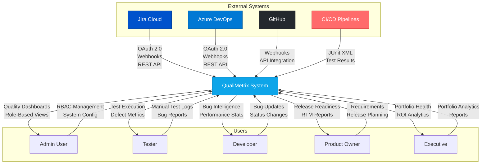
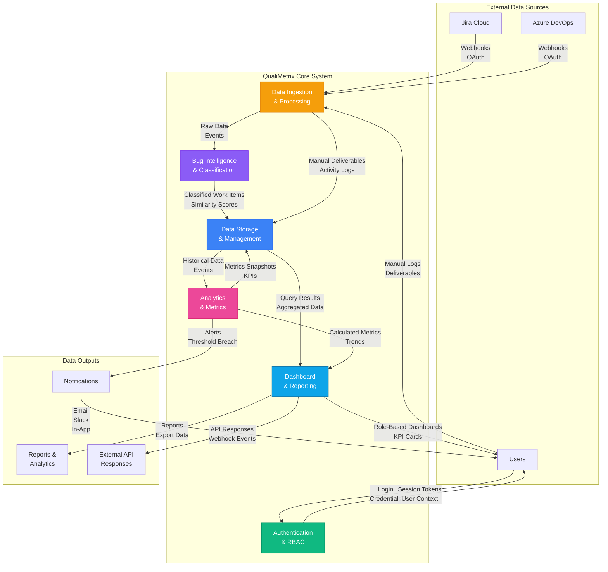
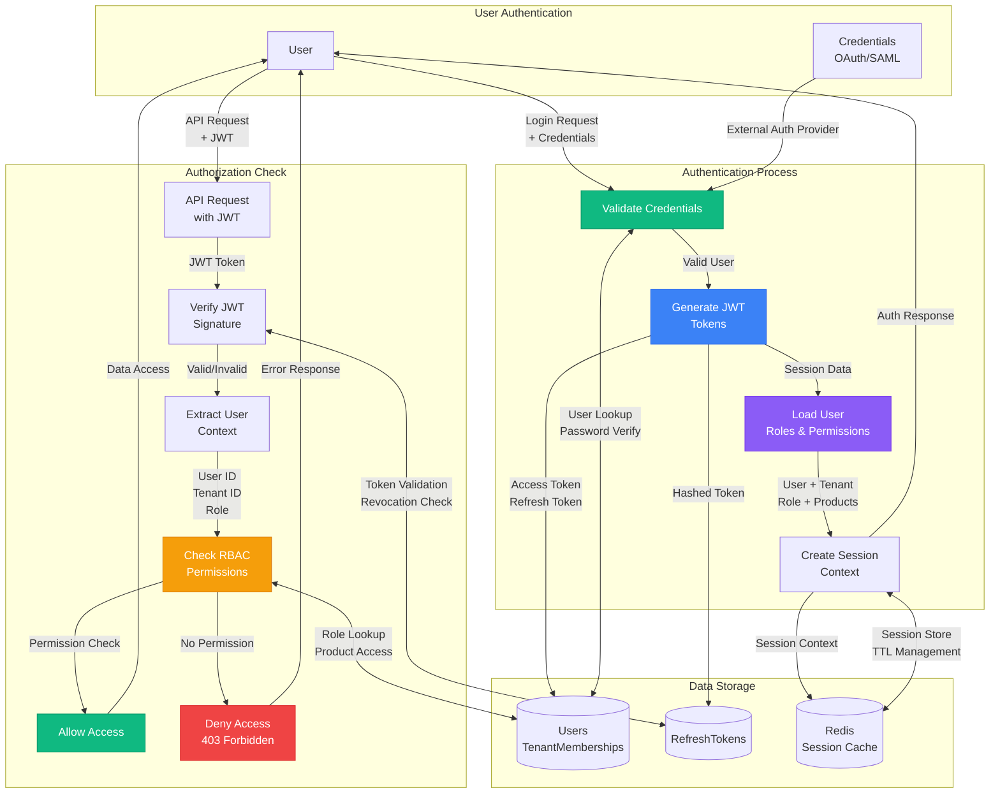
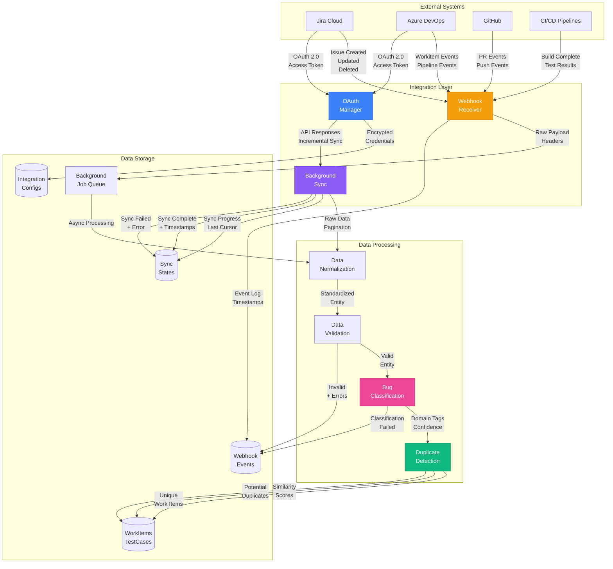
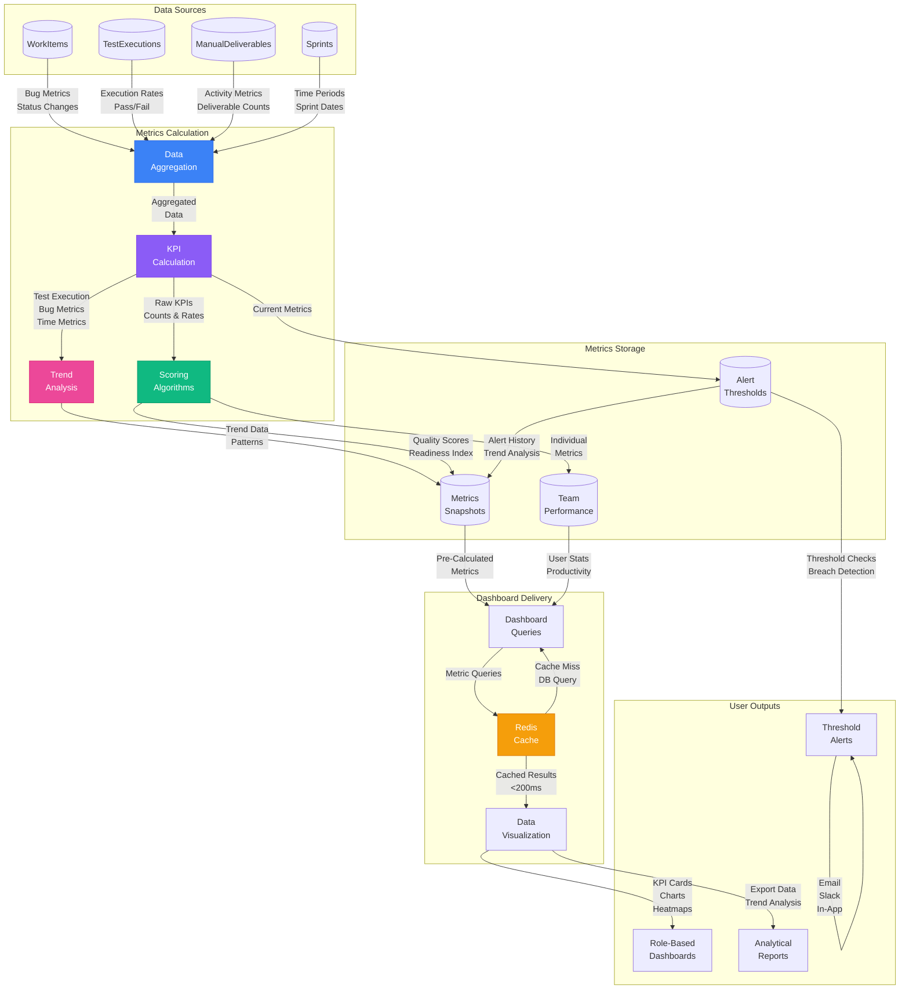
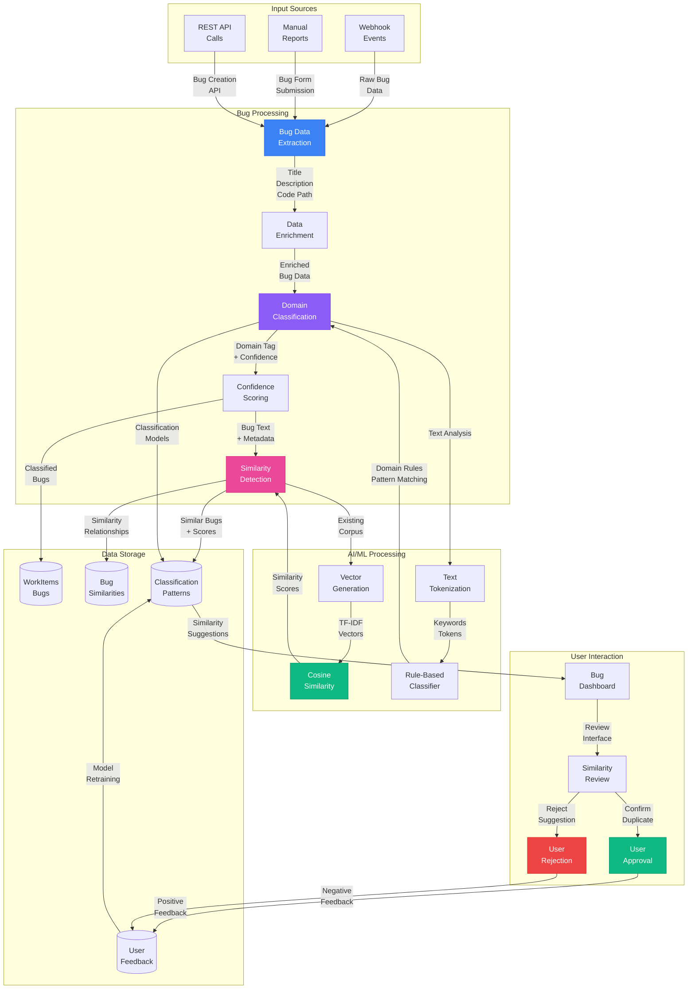
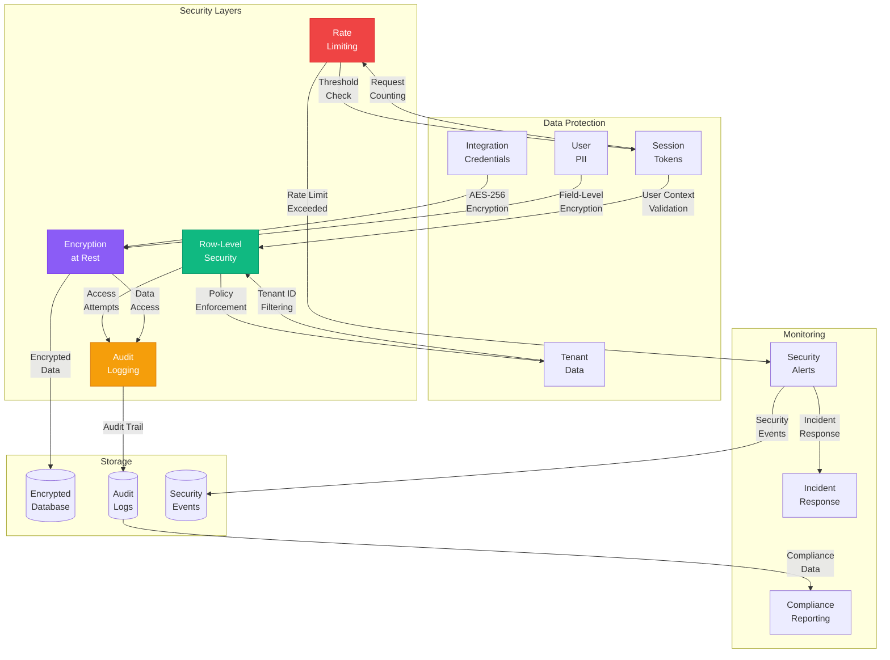
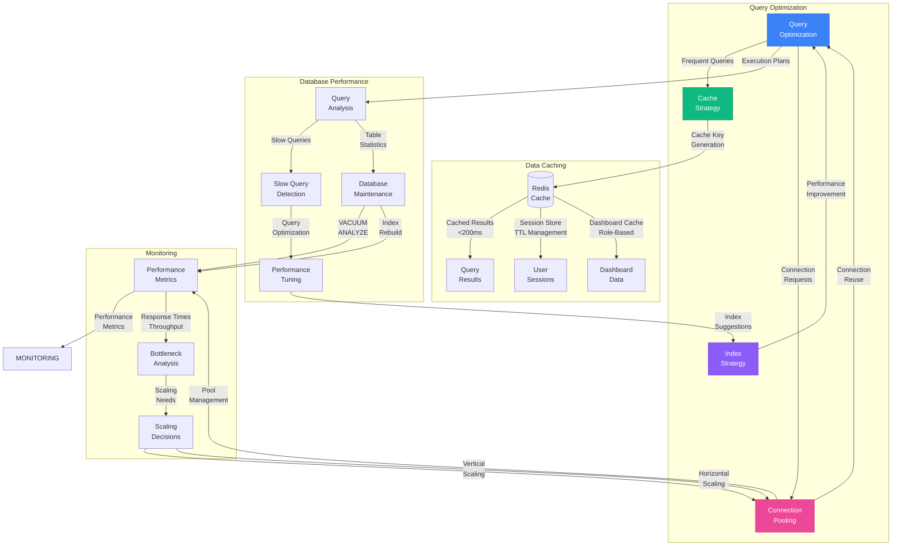
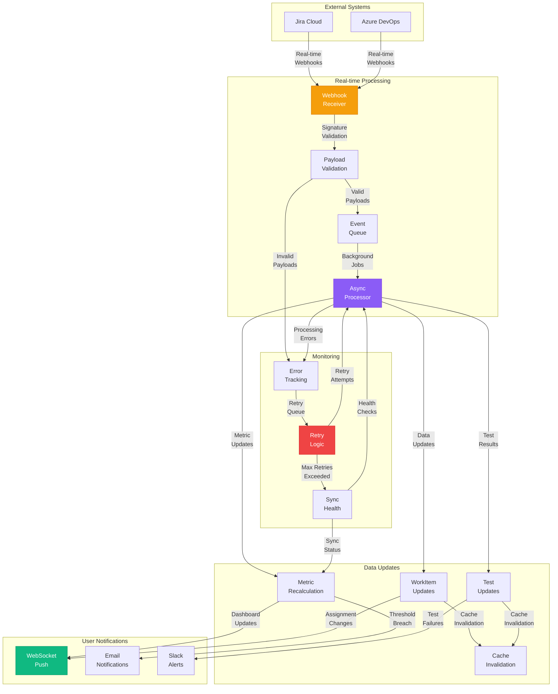

# QualiMetrix Data Flow Diagrams (DFD)

## System Overview
Comprehensive data flow documentation for QualiMetrix showing how data moves through the system from external sources to user dashboards.

---

## Level 0: Context Diagram

### **Context Diagram Description**

**External Systems:**
- **Jira Cloud**: OAuth authentication, webhook events, REST API sync
- **Azure DevOps**: OAuth authentication, area path mapping, work item sync
- **GitHub**: Webhooks for PR/commit tracking, defect density analysis
- **CI/CD Pipelines**: JUnit XML test result ingestion

**User Roles (5 personas):**
- **Admin**: RBAC management, integration configuration, system settings
- **Tester**: Test execution logging, bug reporting, operational deliverables
- **Developer**: Bug triaging, status updates, MTTR tracking
- **Product Owner**: Requirements management, release planning, RTM oversight
- **Executive**: Portfolio analytics, cross-product comparison, ROI tracking

---

## Level 1: Main System Processes

### **Level 1 Process Descriptions**

#### **1. Authentication & RBAC**
- **Input**: User login credentials, OAuth tokens, SAML assertions
- **Process**: JWT token generation, role validation, session management
- **Output**: Session tokens, user context, role-based permissions
- **Storage**: Users, TenantMemberships, RefreshTokens

#### **2. Data Ingestion & Processing**
- **Input**: Webhook events, OAuth API calls, manual form submissions
- **Process**: Payload validation, data normalization, rate limiting
- **Output**: Standardized work items, test executions, deliverables
- **Storage**: WebhookEvents, WorkItems, TestExecutions

#### **3. Bug Intelligence & Classification**
- **Input**: Raw work items, bug descriptions, code paths
- **Process**: Domain classification, similarity detection, duplicate screening
- **Output**: Classified bugs, similarity scores, domain assignments
- **Storage**: BugSimilarities, WorkItems (with domain tags)

#### **4. Data Storage & Management**
- **Input**: All processed data entities
- **Process**: Multi-tenant isolation, RLS policy enforcement, data archiving
- **Output**: Queryable datasets with tenant isolation
- **Storage**: All database tables with RLS enabled

#### **5. Analytics & Metrics**
- **Input**: Historical work items, test executions, deliverables
- **Process**: KPI calculation, trend analysis, metric aggregation
- **Output**: Pre-calculated metrics snapshots, team performance stats
- **Storage**: QualityMetricsSnapshots, TeamPerformanceMetrics

#### **6. Dashboard & Reporting**
- **Input**: User queries, role context, metric snapshots
- **Process**: Data filtering, visualization generation, export formatting
- **Output**: Role-based dashboards, PDF reports, API responses
- **Storage**: Query cache (Redis), export files

---

## Level 2A: Authentication & Authorization Flow

### **Authentication Flow Details**

#### **Login Process**
1. **Credential Validation**: Check local password hash or OAuth/SAML token
2. **Token Generation**: Create JWT access token (15min) + refresh token (7d)
3. **Role Loading**: Fetch user memberships with tenant roles and product access
4. **Session Creation**: Store session context in Redis with 7d TTL

#### **Authorization Process**
1. **JWT Verification**: Validate token signature and expiration
2. **Context Extraction**: Extract user ID, tenant ID, role from JWT claims
3. **Permission Check**: Verify user has required role and product access
4. **Access Control**: Allow/deny based on RBAC policies

---

## Level 2B: External Integration Data Flow

### **Integration Flow Details**

#### **Webhook Processing**
1. **Event Reception**: Receive webhook payload with authentication
2. **Queue Processing**: Store raw event in background job queue
3. **Data Normalization**: Convert external format to internal schema
4. **Entity Processing**: Classify, deduplicate, and store entities

#### **OAuth API Sync**
1. **Token Management**: Handle access token refresh with encrypted storage
2. **Incremental Sync**: Fetch only changed entities using sync cursor
3. **Rate Limiting**: Respect API rate limits with exponential backoff
4. **Error Recovery**: Track sync failures with retry logic

#### **Data Processing Pipeline**
1. **Normalization**: Map Jira/ADO fields to unified schema
2. **Validation**: Enforce data constraints and business rules
3. **Classification**: AI-powered domain tagging with confidence scores
4. **Deduplication**: Similarity detection for duplicate bug screening

---

## Level 2C: Analytics & Metrics Calculation

### **Analytics Flow Details**

#### **Data Aggregation**
1. **Multi-source Collection**: Aggregate data from work items, tests, deliverables
2. **Time-based Grouping**: Group by sprint, date range, or release
3. **Tenant Isolation**: Separate calculations per tenant/product
4. **Incremental Updates**: Only recalculate changed periods

#### **KPI Calculation**
1. **Test Metrics**: Execution rate, pass rate, automation ratio, blocked rate
2. **Bug Metrics**: Creation/resolution rates, leakage rate, reopen rate, escaped defects
3. **Time Metrics**: MTTR, MTTF, resolution duration, time to detect
4. **Quality Metrics**: First-time fix rate, QA rejection rate, defect density

#### **Trend Analysis**
1. **Pattern Detection**: Identify increasing/decreasing trends
2. **Anomaly Detection**: Flag unusual metric variations
3. **Predictive Analysis**: Forecast trends based on historical patterns
4. **Comparative Analysis**: Compare across products, sprints, teams

#### **Scoring Algorithms**
1. **Release Readiness**: Composite score from RTM coverage, defect counts, pass rates
2. **Quality Health Index**: Multi-dimensional quality assessment
3. **Team Performance**: Individual productivity and quality contributions
4. **Automation ROI**: Cost-benefit analysis of automation investments

---

## Level 2D: Bug Intelligence Processing

### **Bug Intelligence Flow Details**

#### **Data Extraction & Enrichment**
1. **Multi-source Input**: Webhook events, manual forms, API calls
2. **Data Enrichment**: Add component, product, sprint context
3. **Text Processing**: Extract title, description, code paths, stack traces
4. **Metadata Addition**: Priority, assignee, reporter, external IDs

#### **Domain Classification**
1. **Rule-Based Classification**: Keyword matching against domain patterns
2. **Text Tokenization**: Extract meaningful terms from bug descriptions
3. **Domain Assignment**: UI/UX, Backend/API, AI/ML Team, Infrastructure
4. **Confidence Scoring**: Calculate classification confidence (0.0-1.0)

#### **Similarity Detection**
1. **Text Vectorization**: TF-IDF vector generation for bug text
2. **Corpus Comparison**: Compare against existing bug database
3. **Cosine Similarity**: Calculate similarity scores (0.0-1.0)
4. **Candidate Ranking**: Return top 3 most similar bugs with scores

#### **User Feedback Loop**
1. **Review Interface**: Present similarity suggestions to users
2. **User Action**: Confirm/reject duplicate suggestions
3. **Model Retraining**: Update classification patterns based on feedback
4. **Accuracy Improvement**: Continuous learning from user corrections

---

## Security Data Flow

### **Security Flow Details**

#### **Encryption at Rest**
1. **Credential Encryption**: AES-256 encryption for OAuth tokens, API keys
2. **Field-Level Encryption**: Sensitive PII fields encrypted individually
3. **Key Management**: Secure key storage with rotation policies
4. **Data Masking**: Sensitive data masked in logs and responses

#### **Row-Level Security**
1. **Tenant Isolation**: Automatic filtering by tenant_id in all queries
2. **Role-Based Access**: Additional filtering based on user roles
3. **Product Access Control**: Respect user's product access permissions
4. **Policy Enforcement**: Database-level RLS policies for all major tables

#### **Audit Logging**
1. **Comprehensive Logging**: All data access, modifications, deletions logged
2. **User Context**: Track user, IP, timestamp for all operations
3. **Data Changes**: Store old/new values for audit trail
4. **Compliance Reporting**: Generate compliance reports from audit logs

#### **Rate Limiting & Monitoring**
1. **Request Throttling**: Per-user and per-tenant rate limits
2. **Anomaly Detection**: Flag unusual access patterns
3. **Security Alerts**: Real-time alerts for security incidents
4. **Incident Response**: Automated and manual incident handling

---

## Performance Optimization Flow

### **Performance Flow Details**

#### **Caching Strategy**
1. **Multi-Layer Cache**: Redis for distributed caching, in-memory for local cache
2. **Cache Keys**: Structured keys with tenant, role, data type
3. **TTL Management**: Different expiration times for different data types
4. **Cache Invalidation**: Smart invalidation on data updates

#### **Query Optimization**
1. **Execution Plans**: Analyze query execution plans for optimization
2. **Index Strategy**: Strategic indexes on frequently queried columns
3. **Query Refactoring**: Optimize expensive queries with better patterns
4. **Connection Pooling**: Reuse database connections for better performance

#### **Database Maintenance**
1. **Regular VACUUM**: Remove dead tuples and reclaim space
2. **Statistics Update**: Keep table statistics current for query planning
3. **Index Rebuild**: Rebuild fragmented indexes for better performance
4. **Partition Management**: Manage time-series partitions for optimal queries

#### **Performance Monitoring**
1. **Metrics Collection**: Track response times, throughput, error rates
2. **Bottleneck Analysis**: Identify performance bottlenecks in data flow
3. **Scaling Decisions**: Make data-driven scaling decisions
4. **Capacity Planning**: Plan capacity based on performance trends

---

## Real-time Data Sync Flow

### **Real-time Sync Flow Details**

#### **Webhook Processing**
1. **Immediate Validation**: Validate webhook signatures and payloads
2. **Queue Processing**: Background job queue for async processing
3. **Error Handling**: Retry logic with exponential backoff
4. **Monitoring**: Track sync health and processing status

#### **Data Updates**
1. **Real-time Updates**: Immediate database updates from webhook data
2. **Metric Recalculation**: Background recalculation of affected metrics
3. **Cache Invalidation**: Smart cache invalidation for updated data
4. **Dashboard Updates**: Real-time dashboard updates via WebSocket

#### **User Notifications**
1. **Immediate Alerts**: Real-time notifications for critical events
2. **Email Notifications**: Batched email notifications for non-critical events
3. **Slack Integration**: Slack alerts for specific event types
4. **WebSocket Push**: Real-time push notifications to connected clients

#### **Monitoring & Reliability**
1. **Sync Health Monitoring**: Track sync status and error rates
2. **Error Tracking**: Comprehensive error logging and tracking
3. **Retry Logic**: Exponential backoff for failed operations
4. **Circuit Breaker**: Circuit breaker pattern for failing integrations

---

This comprehensive DFD documentation covers all major data flows in the QualiMetrix system, from external integrations to user dashboards, with detailed security, performance, and monitoring considerations. Each level provides increasing detail while maintaining clarity about system architecture and data movement.