# QualiMetrix Entity-Relationship Diagram

## System Overview
This ER diagram represents the complete database schema for QualiMetrix, a multi-tenant Quality Intelligence Platform with authentication, RBAC, external integrations, and comprehensive quality analytics.

---

## Complete ER Diagram (Mermaid)

```mermaid
erDiagram
    %% ============================================================
    %% TENANT & ORGANIZATION MANAGEMENT
    %% ============================================================
    Tenant ||--o{ Product : "owns"
    Tenant ||--o{ TenantMembership : "has"
    Tenant ||--o{ Integration : "configures"
    Tenant ||--o{ WebhookEvent : "receives"
    Tenant ||--o{ WorkItem : "contains"
    Tenant ||--o{ TestCase : "defines"
    Tenant ||--o{ ManualDeliverable : "tracks"
    Tenant ||--o{ Sprint : "manages"
    Tenant ||--o{ Release : "publishes"
    Tenant ||--o{ QualityMetricsSnapshot : "generates"
    Tenant ||--o{ TeamPerformanceMetric : "measures"
    Tenant ||--o{ BackgroundJob : "schedules"
    Tenant ||--o{ AuditLog : "logs"
    Tenant ||--o{ ActivityTimeline : "shows"
    Tenant ||--o{ Notification : "sends"
    Tenant ||--o{ NotificationPreference : "configures"
    Tenant ||--o{ RefreshToken : "maintains"

    Tenant {
        uuid id PK
        string name UK
        string slug UK
        string domain UK
        string logoUrl
        jsonb settings
        string subscriptionTier
        int maxUsers
        int maxProducts
        timestamp trialEndsAt
        timestamp createdAt
        timestamp updatedAt
    }

    Product {
        uuid id PK
        uuid tenantId FK
        string name
        string key UK
        string description
        string iconUrl
        string color
        string jiraProjectKey UK
        string azureDevopsAreaPath UK
        string githubRepoFullName UK
        jsonb settings
        boolean isActive
        timestamp createdAt
        timestamp updatedAt
    }

    %% ============================================================
    %% AUTHENTICATION & USER MANAGEMENT
    %% ============================================================
    User ||--o{ TenantMembership : "belongs to"
    User ||--o{ WorkItem : "assigns"
    User ||--o{ WorkItem : "reports"
    User ||--o{ WorkItemComment : "writes"
    User ||--o{ TestCase : "creates"
    User ||--o{ ManualDeliverable : "submits"
    User ||--o{ RefreshToken : "has"
    User ||--o{ AuditLog : "performs"
    User ||--o{ ActivityTimeline : "does"
    User ||--o{ Notification : "receives"
    User ||--o{ NotificationPreference : "configures"

    User {
        uuid id PK
        string email UK
        string passwordHash
        string authProvider
        string fullName
        string avatarUrl
        string timezone
        string language
        string googleId UK
        string githubId UK
        string samlIdp UK
        boolean emailVerified
        boolean isSystemAdmin
        timestamp lastLoginAt
        timestamp createdAt
        timestamp updatedAt
    }

    TenantMembership {
        uuid id PK
        uuid tenantId FK
        uuid userId FK
        string role
        uuid[] accessibleProducts
        string defaultRole
        uuid defaultProductId FK
        jsonb notificationSettings
        uuid invitedBy FK
        timestamp joinedAt
        timestamp updatedAt
    }

    RefreshToken {
        uuid id PK
        uuid userId FK
        uuid tenantId FK
        string tokenHash UK
        timestamp expiresAt
        timestamp createdAt
        timestamp revokedAt
        jsonb deviceInfo
    }

    %% ============================================================
    %% EXTERNAL INTEGRATIONS
    %% ============================================================
    Integration ||--o{ WebhookEvent : "processes"
    Integration ||--o{ SyncState : "tracks"

    Integration {
        uuid id PK
        uuid tenantId FK
        string integrationType UK
        string clientId
        string clientSecretEncrypted
        string accessTokenEncrypted
        string refreshTokenEncrypted
        timestamp tokenExpiresAt
        string apiBaseUrl
        string webhookSecretEncrypted
        boolean syncEnabled
        string syncFrequency
        timestamp lastSyncAt
        string syncStatus
        string lastError
        int errorCount
        timestamp lastSuccessfulSync
        jsonb configuration
        timestamp createdAt
        timestamp updatedAt
    }

    WebhookEvent {
        uuid id PK
        uuid tenantId FK
        string integrationType
        string eventType
        jsonb rawPayload
        boolean processed
        int processingAttempts
        string externalId
        timestamp receivedAt
        timestamp processedAt
        string errorMessage
    }

    SyncState {
        uuid id PK
        uuid tenantId FK
        string integrationType UK
        string resourceType UK
        string lastSyncCursor
        int totalRecords
        int lastSyncCount
        int lastSyncDurationMs
        timestamp lastSuccessfulSync
        timestamp lastFailedSync
        int consecutiveFailures
        timestamp updatedAt
    }

    %% ============================================================
    %% WORK ITEMS & BUG INTELLIGENCE
    %% ============================================================
    WorkItem ||--o{ WorkItem : "parent-child"
    WorkItem ||--o{ BugSimilarity : "source of"
    WorkItem ||--o{ BugSimilarity : "similar to"
    WorkItem ||--o{ WorkItemComment : "has"
    WorkItem ||--o{ WorkItemAttachment : "contains"
    WorkItem ||--o{ TestCase : "covered by"
    WorkItem ||--o{ ManualDeliverable : "linked to"
    WorkItem ||--|| Sprint : "assigned to"
    WorkItem }o--o{ User : "assigned to"
    WorkItem }o--o{ User : "reported by"

    WorkItem {
        uuid id PK
        uuid tenantId FK
        uuid productId FK
        string externalSystem UK
        string externalId UK
        string externalUrl
        string itemType
        string status
        string priority
        string title
        string description
        string acceptanceCriteria
        string domain
        decimal domainConfidence
        string[] tags
        string component
        uuid parentId FK
        uuid sprintId FK
        uuid assigneeId FK
        uuid reporterId FK
        string resolution
        timestamp resolvedAt
        decimal resolutionDurationHours
        boolean isEscapedDefect
        boolean isReopened
        int qaRejectionCount
        boolean firstTimeFix
        timestamp externalCreatedAt
        timestamp externalUpdatedAt
        timestamp createdAt
        timestamp updatedAt
    }

    BugSimilarity {
        uuid id PK
        uuid tenantId FK
        uuid sourceBugId FK
        uuid similarBugId FK
        decimal similarityScore
        string similarityMethod
        boolean userConfirmed
        boolean userRejected
        uuid reviewedBy FK
        timestamp reviewedAt
        timestamp createdAt
    }

    WorkItemComment {
        uuid id PK
        uuid workItemId FK
        uuid userId FK
        string externalCommentId UK
        string commentBody
        boolean isInternal
        timestamp createdAt
        timestamp updatedAt
        timestamp externalCreatedAt
    }

    WorkItemAttachment {
        uuid id PK
        uuid workItemId FK
        string fileName
        string fileUrl
        bigint fileSizeBytes
        string mimeType
        string externalAttachmentId
        uuid uploadedBy FK
        timestamp createdAt
    }

    %% ============================================================
    %% TEST MANAGEMENT
    %% ============================================================
    TestCase ||--o{ TestExecution : "has"
    TestCase ||--o{ WorkItem : "covers"

    TestCase {
        uuid id PK
        uuid tenantId FK
        uuid productId FK
        string externalSystem UK
        string externalId UK
        string externalUrl
        string name
        string description
        string testType
        string automationStatus
        uuid[] coveredStoryIds
        string[] requirementIds
        jsonb testSteps
        string priority
        string[] tags
        string component
        uuid createdBy FK
        uuid updatedBy FK
        timestamp externalCreatedAt
        timestamp externalUpdatedAt
        timestamp createdAt
        timestamp updatedAt
    }

    TestExecution ||--o{ TestExecutionEvidence : "evidenced by"

    TestExecution {
        uuid id PK
        uuid tenantId FK
        uuid testCaseId FK
        string executionRun
        uuid sprintId FK
        string environment
        uuid executedBy FK
        string status
        int durationSeconds
        string executionNotes
        string failureReason
        boolean isFlake
        string externalRunId
        string externalTestId
        timestamp executedAt
        timestamp createdAt
    }

    TestExecutionEvidence {
        uuid id PK
        uuid testExecutionId FK
        string evidenceType
        string fileUrl
        string description
        timestamp capturedAt
    }

    %% ============================================================
    %% MANUAL DELIVERABLES
    %% ============================================================
    ManualDeliverable ||--o{ DeliverableCollaborator : "collaborators"
    ManualDeliverable ||--o{ WorkItem : "related"

    ManualDeliverable {
        uuid id PK
        uuid tenantId FK
        uuid productId FK
        string deliverableType
        string title
        string description
        jsonb metadata
        string[] externalUrls
        uuid[] relatedWorkItemIds
        uuid createdBy FK
        timestamp deliveredAt
        timestamp createdAt
        timestamp updatedAt
    }

    DeliverableCollaborator {
        uuid id PK
        uuid deliverableId FK
        uuid userId FK
        string role
    }

    %% ============================================================
    %% SPRINTS & RELEASES
    %% ============================================================
    Sprint {
        uuid id PK
        uuid tenantId FK
        uuid productId FK
        string name
        int sequence
        date startDate
        date endDate
        string state
        string externalSystem
        string externalId
        string sprintGoal
        string retrospectiveNotes
        timestamp createdAt
        timestamp updatedAt
    }

    Release {
        uuid id PK
        uuid tenantId FK
        uuid productId FK
        string version
        string name
        date targetDate
        date actualDate
        string state
        int storiesCompleted
        int bugsResolved
        decimal testExecutionRate
        decimal releaseReadinessScore
        string releaseNotes
        timestamp createdAt
        timestamp updatedAt
    }

    %% ============================================================
    %% QUALITY METRICS
    %% ============================================================
    QualityMetricsSnapshot }o--o| Sprint : "for"
    QualityMetricsSnapshot }o--o| Release : "for"

    QualityMetricsSnapshot {
        uuid id PK
        uuid tenantId FK
        uuid productId FK
        string snapshotType UK
        date snapshotDate UK
        uuid sprintId FK
        uuid releaseId FK
        int testCasesExecuted
        int testCasesPassed
        int testCasesFailed
        int testCasesBlocked
        decimal testAutomationRate
        int bugsCreated
        int bugsResolved
        int bugsEscaped
        int bugsReopened
        decimal defectLeakageRate
        decimal mttr
        decimal mttf
        decimal firstTimeFixRate
        decimal qaRejectionRate
        decimal defectDensity
        decimal rtmCoverageRate
        decimal automationRoi
        decimal releaseReadinessScore
        int openP0P1Count
        decimal regressionPassRate
        decimal costOfQuality
        jsonb metadata
        timestamp calculatedAt
    }

    TeamPerformanceMetric }o--o| Sprint : "for"

    TeamPerformanceMetric {
        uuid id PK
        uuid tenantId FK
        uuid userId FK
        uuid productId FK
        string periodType UK
        date periodStart UK
        date periodEnd
        int bugsAssigned
        int bugsResolved
        decimal avgMttrHours
        decimal firstTimeFixRate
        int qaRejections
        int testsExecuted
        decimal testPassRate
        int demosDelivered
        int docsCreated
        decimal manualHoursLogged
        decimal automationHoursSaved
        timestamp calculatedAt
    }

    %% ============================================================
    %% BACKGROUND PROCESSING
    %% ============================================================
    BackgroundJob {
        uuid id PK
        uuid tenantId FK
        string jobType
        string jobName
        jsonb payload
        int priority
        string status
        int progress
        jsonb result
        string errorMessage
        int retryCount
        int maxRetries
        timestamp scheduledAt
        timestamp startedAt
        timestamp completedAt
        timestamp createdAt
    }

    %% ============================================================
    %% AUDIT & ACTIVITY
    %% ============================================================
    AuditLog {
        uuid id PK
        uuid tenantId FK
        uuid userId FK
        string action
        string resourceType
        uuid resourceId
        inet ipAddress
        string userAgent
        uuid requestId
        jsonb oldValues
        jsonb newValues
        timestamp createdAt
    }

    ActivityTimeline {
        uuid id PK
        uuid tenantId FK
        uuid userId FK
        string activityType
        string title
        string description
        string entityType
        uuid entityId
        uuid productId FK
        string visibility
        jsonb metadata
        timestamp createdAt
    }

    %% ============================================================
    %% NOTIFICATIONS
    %% ============================================================
    Notification {
        uuid id PK
        uuid tenantId FK
        uuid userId FK
        string notificationType
        string title
        string body
        string actionUrl
        string actionLabel
        string priority
        string[] deliveryMethods
        timestamp readAt
        boolean deliveredEmail
        boolean deliveredSlack
        timestamp expiresAt
        timestamp createdAt
    }

    NotificationPreference {
        uuid id PK
        uuid userId FK
        uuid tenantId FK
        string notificationType UK
        boolean enabled
        string[] deliveryMethods
        jsonb thresholdConfig
    }
```

---

## Detailed Entity Descriptions

### **Core Domain Entities**

#### **1. Tenant (Organization)**
- **Purpose**: Multi-tenant isolation for different organizations
- **Key Attributes**: Organization name, custom domain, subscription tier, limits
- **Relationships**: Owns all tenant-specific data (products, users, work items)
- **Constraints**: Unique slug for URL routing, optional custom domain

#### **2. Product (Project)**
- **Purpose**: Represents individual products/projects being tracked
- **Key Attributes**: Project key (Jira/ADO), external system references, UI theming
- **Relationships**: Links to external systems (Jira, ADO, GitHub)
- **Constraints**: Unique key per tenant, optional external ID mapping

#### **3. User**
- **Purpose**: System users with cross-tenant authentication support
- **Key Attributes**: Email, auth provider (local/OAuth/SAML), profile info
- **Relationships**: Multiple tenant memberships with different roles
- **Constraints**: Unique email, optional external IDs for OAuth

#### **4. TenantMembership**
- **Purpose**: User roles and permissions within specific tenants
- **Key Attributes**: Role (admin/lead/dev/tester/po/executive/viewer), product access
- **Relationships**: Links users to tenants with specific permissions
- **Constraints**: One membership per user per tenant

### **Integration Entities**

#### **5. Integration**
- **Purpose**: External system configurations (Jira, ADO, GitHub, CI)
- **Key Attributes**: OAuth credentials, sync settings, API endpoints
- **Relationships**: Sync state tracking, webhook processing
- **Security**: Encrypted credentials (AES-256)

#### **6. WebhookEvent**
- **Purpose**: Incoming webhook payload processing
- **Key Attributes**: Event type, raw payload, processing status
- **Relationships**: Links to integration for context
- **Constraints**: Retry logic with exponential backoff

### **Work Management Entities**

#### **7. WorkItem**
- **Purpose**: Central work tracking (stories, bugs, tasks, epics)
- **Key Attributes**: Type, status, priority, domain classification, quality metrics
- **Relationships**: Parent-child hierarchy, assignees, test coverage
- **Intelligence**: Domain classification, similarity detection

#### **8. BugSimilarity**
- **Purpose**: AI-powered duplicate bug detection
- **Key Attributes**: Similarity score, method (TF-IDF/embeddings), user feedback
- **Relationships**: Links source bug to similar bugs
- **Learning**: User confirmation/rejection improves accuracy

#### **9. TestCase**
- **Purpose**: Test case management with automation tracking
- **Key Attributes**: Test type, automation status, coverage mapping
- **Relationships**: Test executions, work item coverage
- **Traceability**: RTM support with requirement IDs

#### **10. TestExecution**
- **Purpose**: Individual test run results
- **Key Attributes**: Status, environment, duration, failure analysis
- **Relationships**: Test case, evidence collection
- **Quality**: Flake detection, external run ID for CI integration

### **Metrics & Analytics Entities**

#### **11. QualityMetricsSnapshot**
- **Purpose**: Pre-calculated metrics for fast dashboard queries
- **Key Attributes**: All quality KPIs (execution rates, bug metrics, MTTR, etc.)
- **Relationships**: Sprint/release association for time-series analysis
- **Performance**: Optimized for <200ms dashboard loads

#### **12. TeamPerformanceMetric**
- **Purpose**: Individual and team performance tracking
- **Key Attributes**: Productivity metrics by period (daily/weekly/sprint)
- **Relationships**: User, product, sprint associations
- **Analytics**: Trend analysis for performance reviews

### **Activity & Collaboration Entities**

#### **13. ManualDeliverable**
- **Purpose**: Activity logging for demos, docs, RCAs, manual testing
- **Key Attributes**: Type, metadata (ratings, hours), external URLs
- **Relationships**: Collaborators, related work items
- **Flexibility**: JSON metadata for custom fields

#### **14. ActivityTimeline**
- **Purpose**: User-facing activity feed
- **Key Attributes**: Activity type, visibility, related entities
- **Relationships**: User actions across the system
- **Engagement**: Role-based visibility filtering

### **System Management Entities**

#### **15. BackgroundJob**
- **Purpose**: Async task processing (sync, calculations, webhooks)
- **Key Attributes**: Job type, priority, retry logic, progress tracking
- **Relationships**: Tenant-scoped job execution
- **Reliability**: Retry mechanism with exponential backoff

#### **16. Notification**
- **Purpose**: Multi-channel notification system
- **Key Attributes**: Type, priority, delivery methods, expiration
- **Relationships**: User notification preferences
- **Channels**: In-app, email, Slack delivery

---

## Relationship Types

### **One-to-Many (1:N)**
- Tenant → Products, Users, WorkItems, etc.
- User → TenantMemberships
- Product → WorkItems, TestCases
- WorkItem → Comments, Attachments
- TestCase → TestExecutions

### **Many-to-Many (M:N)**
- User ↔ Tenant (via TenantMembership)
- WorkItem ↔ WorkItem (parent-child hierarchy)
- TestCase ↔ WorkItem (coverage tracking)
- ManualDeliverable ↔ WorkItem (related items)

### **One-to-One (1:1)**
- TenantMembership → DefaultProduct
- TestExecution → Evidence (optional)

---

## Key Design Patterns

### **1. Multi-Tenancy**
- All major entities include `tenantId` for data isolation
- Row-Level Security (RLS) policies for automatic filtering
- Tenant-scoped queries for performance optimization

### **2. Soft References**
- Optional foreign keys (`productId FK`) allow data flexibility
- `externalId` fields for cross-system mapping
- Array relationships for flexible associations

### **3. Temporal Data**
- `createdAt`, `updatedAt` for audit trails
- `externalCreatedAt` for preserving external timestamps
- `deletedAt` (implicit) for soft deletes

### **4. JSON Metadata**
- Flexible `settings`, `metadata`, `configuration` fields
- Schema evolution without database migrations
- Custom fields per tenant/product

### **5. Performance Optimization**
- Pre-calculated metrics snapshots
- Indexed foreign keys and frequently queried fields
- Separate time-series tables for analytics

---

## Data Integrity & Constraints

### **Primary Keys**
- All tables use UUID primary keys for distributed system compatibility
- UUID generation via `uuid-ossp` PostgreSQL extension

### **Unique Constraints**
- User emails, tenant slugs, product keys
- Composite uniqueness for multi-tenant entities
- External ID mapping uniqueness

### **Foreign Key Relationships**
- Cascading deletes for tenant data cleanup
- Set null for optional relationships
- Referential integrity for data consistency

### **Check Constraints**
- Email format validation
- Date range validation (start < end)
- Enum constraints for status fields

---

## Index Strategy

### **Clustered Indexes**
- Primary key indexes for all tables
- Temporal indexes on timestamp fields

### **Non-Clustered Indexes**
- Foreign key indexes for join performance
- Composite indexes for common query patterns
- Unique indexes for business constraints

### **Special Indexes**
- GIN indexes for array fields (tags, coveredStoryIds)
- Full-text search indexes on text fields
- Vector indexes for AI similarity search

---

## Partition Strategy (Future Scalability)

### **Time-Series Partitioning**
- `quality_metrics_snapshots` by date (monthly partitions)
- `test_executions` by execution date
- `audit_logs` by timestamp

### **Tenant Partitioning** 
- Large tables could be partitioned by `tenantId`
- Improves query performance for multi-tenant isolation
- Enables tenant-level data archival

---

This ER diagram provides the foundation for all QualiMetrix functionality, from authentication and external integrations to comprehensive quality analytics and team performance tracking.