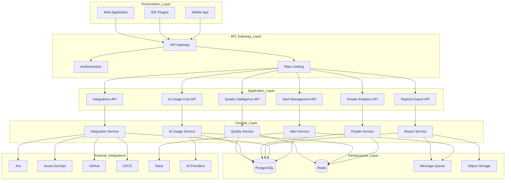
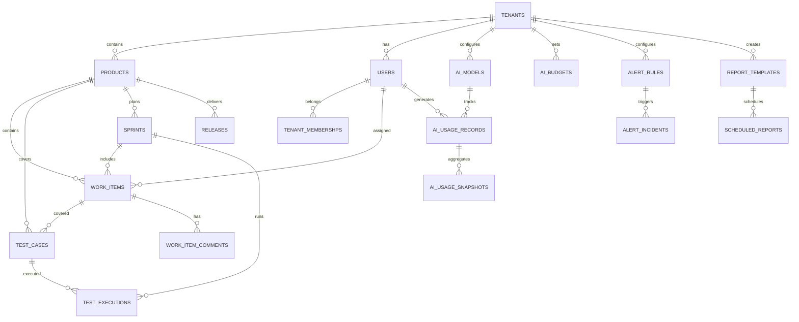
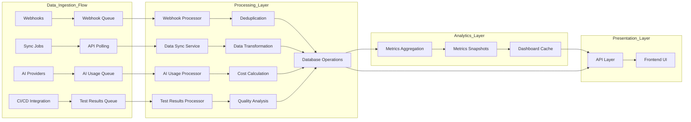
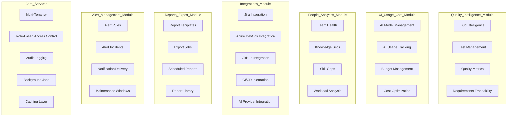
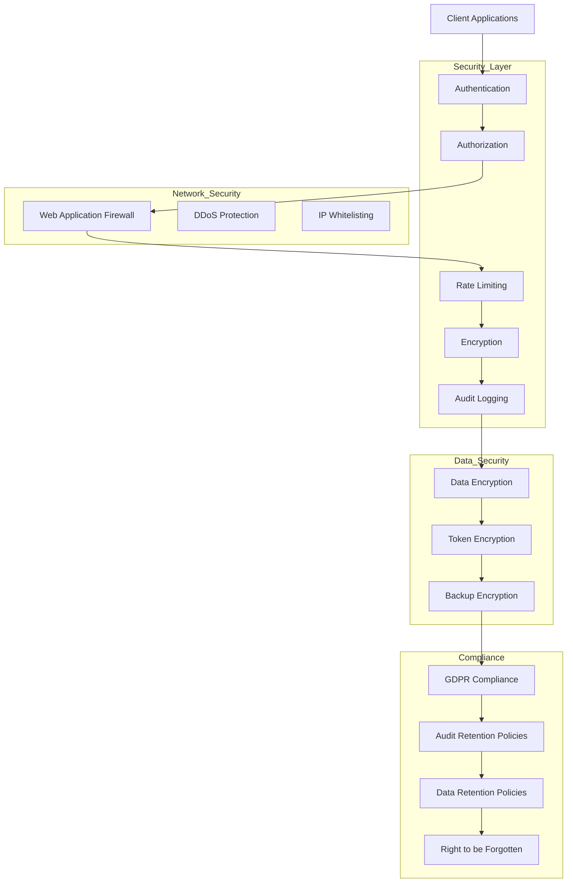
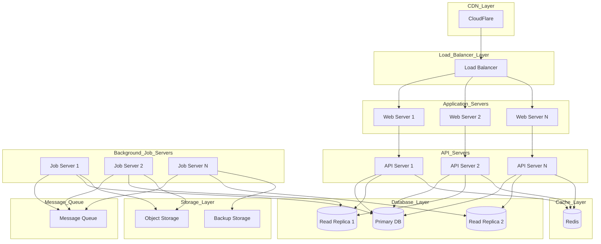

# QualiMetrix - Clean Architecture Diagram

## 🏛️ System Architecture Overview

QualiMetrix is a **Multi-Tenant Quality Intelligence Platform** with comprehensive analytics, AI cost management, and enterprise-grade integrations.

---

## 📐 Architecture Layers

---

## 🗄️ Database Architecture

---

## 🔄 Data Flow Architecture

---

## 🎯 Module Architecture

---

## 🔐 Security Architecture

---

## 🚀 Deployment Architecture

---

## 📊 Technology Stack

### Frontend
| Component | Technology |
|-----------|------------|
| Framework | React 18+ |
| Routing | TanStack Router |
| Styling | Tailwind CSS |
| Charts | Recharts |
| State Management | Zustand/React Query |
| Build | Vite |

### Backend
| Component | Technology |
|-----------|------------|
| Runtime | Node.js / TypeScript |
| Framework | Express.js / Fastify |
| ORM | Prisma |
| Database | PostgreSQL 15+ |
| Cache | Redis 7+ |
| Message Queue | RabbitMQ / Redis Queue |
| Auth | JWT + OAuth 2.0 |

### DevOps
| Component | Technology |
|-----------|------------|
| Containerization | Docker |
| Orchestration | Kubernetes |
| CI/CD | GitHub Actions |
| Monitoring | Prometheus + Grafana |
| Logging | ELK Stack |
| CDN | CloudFront/CloudFlare |

---

## 🎨 Design Principles

### 1. **Separation of Concerns**
- Clear layer boundaries
- Minimal coupling between layers
- High cohesion within modules

### 2. **Multi-Tenancy First**
- Tenant isolation at all layers
- RBAC + ABAC security model
- Per-tenant data isolation

### 3. **Performance Optimization**
- Redis caching for hot data
- Database read replicas
- Async processing with queues
- CDN for static assets

### 4. **Scalability**
- Horizontal scaling ready
- Database partitioning strategy
- Message queue for async operations
- Stateless application servers

### 5. **Security**
- Defense in depth
- Encryption at rest and in transit
- Comprehensive audit logging
- Rate limiting and DDoS protection

---

## 🔄 Request Flow Example

### Bug Intelligence Request Flow:
1. **Client** → Bug Intelligence Page Load
2. **API Gateway** → Authentication & Authorization
3. **Quality API** → Check Redis Cache
4. **Cache Miss** → Query PostgreSQL with tenant isolation
5. **Database** → Return bug data with domain classification
6. **Quality API** → Apply RBAC filtering
7. **API Gateway** → Rate limiting & response formatting
8. **Client** → Render bug intelligence dashboard

### AI Usage Recording Flow:
1. **IDE Plugin** → AI API call made (Claude/GPT)
2. **AI Provider** → Returns usage data
3. **IDE Plugin** → Async POST to AI Usage API
4. **API Gateway** → Authentication & validation
5. **AI Usage API** → Queue usage record (non-blocking)
6. **Background Job** → Process usage record
7. **Database** → Store in ai_usage_records
8. **Aggregation Job** → Update ai_usage_snapshots
9. **Dashboard** → Real-time cost visibility

---

## 🎯 Integration Points

### External Systems Integration:
| System | Integration Type | Data Flow |
|--------|------------------|-----------|
| Jira | Bi-directional sync | Issues, comments, status |
| Azure DevOps | Bi-directional sync | Work items, test cases |
| GitHub | Webhooks + API | Issues, PRs, commits |
| CI/CD | Webhooks | Test results, build status |
| Slack | Outbound webhooks | Alerts, notifications |
| AI Providers | API polling | Usage, costs, models |

### Internal Service Communication:
| Service | Communication Pattern | Purpose |
|---------|---------------------|---------|
| APIs → Database | Direct connection | Read/write operations |
| APIs → Redis | Direct connection | Caching, sessions |
| APIs → Background Jobs | Message Queue | Async processing |
| Background Jobs → Database | Direct connection | Aggregation, cleanup |
| Alert Service → Slack | HTTP webhooks | Notifications |

---

## 📈 Scalability Strategy

### Horizontal Scaling:
- **Web Servers**: Auto-scaling based on CPU/memory
- **API Servers**: Auto-scaling based on request count
- **Job Servers**: Queue-based scaling
- **Database**: Read replicas for query scaling

### Vertical Scaling:
- **Database**: Connection pooling, query optimization
- **Cache**: Redis clustering, memory optimization
- **Storage**: Object storage with CDN

### Data Partitioning:
- **Partition by tenant_id**: Primary isolation strategy
- **Time-series partitioning**: For ai_usage_records, quality_metrics_snapshots
- **Geographic partitioning**: Multi-region deployment

---

## 🔍 Monitoring & Observability

### Application Metrics:
- Request rate, latency, error rate
- Database query performance
- Cache hit rates
- Background job processing time
- External integration health

### Business Metrics:
- User engagement and adoption
- AI usage trends and costs
- Quality metrics improvement
- Alert effectiveness
- Report generation success

### System Metrics:
- CPU, memory, disk usage
- Network traffic
- Database connections
- Queue depth
- Cache memory usage

---

## 🎯 Architecture Sign-Off Checklist

### ✅ Functional Requirements
- [x] Multi-tenant quality intelligence
- [x] Bug intelligence with ML classification
- [x] Test management and execution
- [x] AI usage and cost management
- [x] People analytics and team health
- [x] Comprehensive reporting
- [x] Alert management
- [x] External integrations (Jira, ADO, GitHub, CI/CD)

### ✅ Non-Functional Requirements
- [x] Scalability (horizontal + vertical)
- [x] Performance (caching, CDNs, optimization)
- [x] Security (encryption, RBAC, audit logging)
- [x] Reliability (backups, replication, error handling)
- [x] Maintainability (clean architecture, documentation)
- [x] Monitoring (metrics, logging, alerts)

### ✅ Technical Excellence
- [x] Clean separation of concerns
- [x] Database schema design
- [x] API design principles
- [x] Background job architecture
- [x] Integration patterns
- [x] Deployment strategy

---

## 🚀 Implementation Roadmap

### Phase 1: Core Platform (Foundation)
- Multi-tenant infrastructure
- User authentication and RBAC
- Basic quality tracking
- Core integrations (Jira/ADO)

### Phase 2: Advanced Features (Current State)
- Advanced analytics and metrics
- People analytics
- CI/CD integration
- Alert management system
- **AI Usage & Cost Management** ⭐

### Phase 3: Enterprise Features (Future)
- Advanced reporting and export
- Machine learning models
- Real-time collaboration
- Mobile applications
- Advanced AI integrations

---

## 📝 Architecture Decision Records

### 1. Multi-Tenancy Strategy
**Decision**: Use tenant_id isolation at database and application level
**Rationale**: Clear data isolation, compliance requirements, performance optimization

### 2. Database Choice
**Decision**: PostgreSQL as primary database
**Rationale**: ACID compliance, JSONB support, full-text search, mature ecosystem

### 3. Cache Strategy
**Decision**: Redis for caching, sessions, and queues
**Rationale**: Performance, versatility, battle-tested

### 4. AI Usage Tracking
**Decision**: Async recording with aggregation snapshots
**Rationale**: High-volume data, real-time requirements, dashboard performance

### 5. Integration Architecture
**Decision**: Bi-directional sync with webhooks
**Rationale**: Real-time updates, external system compatibility, fault tolerance

---

## 🎯 Success Metrics

### Technical Metrics:
- **Performance**: 95th percentile latency <500ms
- **Availability**: 99.9% uptime SLA
- **Scalability**: Handle 10x growth without architecture changes
- **Security**: Zero security breaches, 100% audit coverage

### Business Metrics:
- **User Adoption**: 80% of target users active weekly
- **Time to Value**: <30 minutes from signup to first insight
- **AI Cost Savings**: 20% reduction in AI spending through optimization
- **Quality Improvement**: 15% reduction in defect leakage

---

## 🎉 Architecture Sign-Off

**This architecture provides:**
- ✅ **Scalability** to handle enterprise workloads
- ✅ **Security** for sensitive quality and cost data
- ✅ **Performance** for real-time analytics
- ✅ **Flexibility** to integrate with various tools
- ✅ **Maintainability** for long-term evolution
- ✅ **Innovation** platform for AI-powered quality insights

**Approved for Implementation** ✅

---

*Architecture Document Version: 1.0*
*Last Updated: 2026-08-06*
*Maintained by: QualiMetrix Architecture Team*