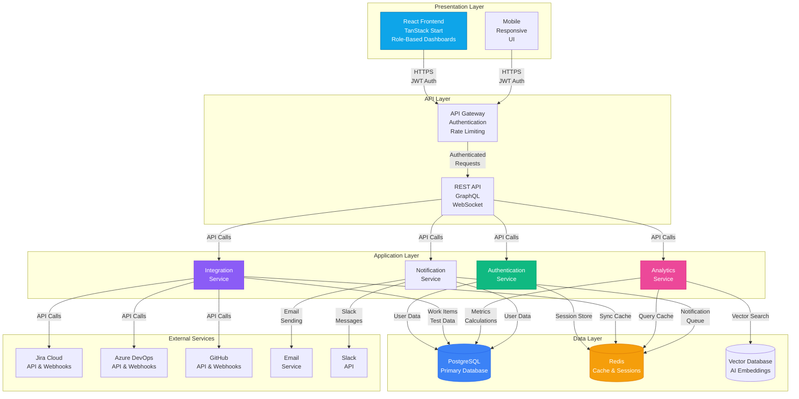

# QualiMetrix System Architecture Documentation

## Complete Documentation Suite

This document provides a comprehensive overview of the QualiMetrix system architecture, tying together all diagrams and technical specifications.

---

## 📋 Documentation Index

1. **[Database Schema Requirements](../database-schema.md)** - Complete SQL schema and entity specifications
2. **[ER Diagram](./er-diagram.md)** - Entity-Relationship diagram with detailed entity descriptions
3. **[Data Flow Diagrams](./dfd-levels.md)** - Multi-level DFDs covering all system processes
4. **[Database Setup Guide](../database-setup-guide.md)** - Implementation and deployment guide
5. **[Prisma Schema](../prisma/schema.prisma)** - ORM implementation specification

---

## 🏗️ System Architecture Overview

### **High-Level Architecture**



---

## 🔄 Complete Data Flow Analysis

### **End-to-End Flow: From Jira to Dashboard**

#### **Phase 1: External Data Collection**
```
Jira Cloud (Issue Created)
    ↓ OAuth 2.0 Webhook
Webhook Receiver (Validation)
    ↓ Background Job Queue
Data Normalization (Jira → Unified Schema)
    ↓ Entity Mapping
WorkItem Creation (Database Insert)
```

#### **Phase 2: Intelligence Processing**
```
Raw WorkItem Data
    ↓ Text Analysis
Domain Classification (Rule-Based AI)
    ↓ TF-IDF Vectorization
Similarity Detection (Cosine Similarity)
    ↓ Scoring Algorithm
BugSimilarity Records (Database Insert)
```

#### **Phase 3: Metrics Calculation**
```
WorkItem + TestExecution + Deliverable Data
    ↓ Data Aggregation (per Sprint/Product)
QualityMetricsSnapshot Calculation
    ↓ KPI Computation
Pre-Calculated Metrics (Database Insert)
    ↓ Cache Invalidation
Redis Cache Update
```

#### **Phase 4: Dashboard Delivery**
```
User Dashboard Request (with JWT)
    ↓ Authentication Check
Role-Based Data Filtering (RBAC)
    ↓ Redis Cache Lookup
Cached Metrics (if available)
    ↓ Query Results
Dashboard Component Rendering
    ↓ Visualization
KPI Cards, Charts, Heatmaps (UI Display)
```

---

## 🛡️ Security Architecture

### **Defense in Depth Strategy**

#### **Layer 1: Network Security**
- **TLS/SSL**: All communications encrypted with TLS 1.3
- **API Gateway**: Centralized security enforcement point
- **Rate Limiting**: Per-user and per-tenant request throttling
- **DDoS Protection**: Cloudflare or similar DDoS protection

#### **Layer 2: Authentication & Authorization**
- **JWT Tokens**: Short-lived access tokens (15min) + Refresh tokens (7d)
- **Multi-Factor Auth**: Optional 2FA for admin accounts
- **OAuth 2.0/SAML**: Enterprise authentication support
- **RBAC**: 7 roles with granular permissions

#### **Layer 3: Data Security**
- **Encryption at Rest**: AES-256 for sensitive data (credentials, PII)
- **Row-Level Security**: Tenant isolation enforced at database level
- **Field-Level Encryption**: PII fields encrypted individually
- **Secure Key Management**: Key rotation and secure key storage

#### **Layer 4: Application Security**
- **Input Validation**: Comprehensive validation and sanitization
- **SQL Injection Prevention**: Parameterized queries via Prisma ORM
- **XSS Protection**: Content Security Policy and input sanitization
- **CSRF Protection**: Token-based CSRF protection

#### **Layer 5: Audit & Monitoring**
- **Comprehensive Logging**: All security events logged
- **Audit Trail**: Complete data change history
- **Security Monitoring**: Real-time threat detection
- **Incident Response**: Automated incident response procedures

---

## ⚡ Performance Architecture

### **Performance Optimization Strategy**

#### **Database Performance**
```sql
-- Strategic Indexing
CREATE INDEX idx_workitems_tenant_product_status 
ON work_items(tenant_id, product_id, status);

CREATE INDEX idx_test_executions_sprint_status 
ON test_executions(sprint_id, status);

-- Partitioning for Time-Series Data
CREATE TABLE quality_metrics_snapshots (
    -- fields
) PARTITION BY RANGE (snapshot_date);

-- Materialized Views for Complex Queries
CREATE MATERIALIZED VIEW bug_metrics_summary AS
SELECT tenant_id, product_id, 
       COUNT(*) FILTER (WHERE status = 'Open') as open_bugs,
       AVG(resolution_duration_hours) as avg_mttr
FROM work_items
WHERE item_type = 'bug'
GROUP BY tenant_id, product_id;
```

#### **Caching Strategy**
```
┌─────────────────────────────────────────────────┐
│  L1: In-Memory Cache (Server)                   │
│  • Query results                                 │
│  • Session data                                  │
│  • TTL: 1-5 minutes                             │
├─────────────────────────────────────────────────┤
│  L2: Redis Cache (Distributed)                  │
│  • Dashboard data                                │
│  • User sessions                                │
│  • API responses                                │
│  • TTL: 5-60 minutes                            │
├─────────────────────────────────────────────────┤
│  L3: Database Cache (PostgreSQL)               │
│  • Pre-calculated metrics                       │
│  • Materialized views                           │
│  • Query result caching                         │
│  • TTL: 1-24 hours                             │
└─────────────────────────────────────────────────┘
```

#### **Query Optimization**
- **Connection Pooling**: PgBouncer with transaction pooling
- **Query Batching**: Batch multiple queries in single transactions
- **Lazy Loading**: Load related data only when needed
- **Pagination**: Limit query results with efficient pagination

#### **Background Processing**
```
┌─────────────────────────────────────────────────┐
│  Job Queue (BullMQ / RabbitMQ)                 │
├─────────────────────────────────────────────────┤
│  Priority Levels:                               │
│  • P0: Critical (Security alerts)              │
│  • P1: High (User actions)                      │
│  • P2: Medium (Data sync)                      │
│  • P3: Low (Background tasks)                  │
├─────────────────────────────────────────────────┤
│  Worker Pools:                                   │
│  • 4 workers for webhook processing             │
│  • 2 workers for metrics calculation            │
│  • 2 workers for notifications                 │
│  • 1 worker for data aggregation               │
└─────────────────────────────────────────────────┘
```

---

## 🔌 Integration Architecture

### **External Integration Patterns**

#### **Jira Cloud Integration**
```typescript
// OAuth 2.0 Flow
1. User initiates Jira connection
2. Redirect to Jira OAuth authorization
3. User grants permissions
4. Receive authorization code
5. Exchange for access token
6. Store encrypted token
7. Begin background sync

// Webhook Processing
1. Receive Jira webhook event
2. Validate webhook signature
3. Queue background job
4. Normalize Jira data format
5. Create/update WorkItem
6. Trigger metrics recalculation
7. Send notifications if needed

// Background Sync
1. Fetch incremental changes using cursor
2. Process paginated results
3. Update sync state cursor
4. Handle rate limits with backoff
5. Retry failed requests
6. Update sync status
```

#### **Azure DevOps Integration**
```typescript
// Similar to Jira but with ADO-specific handling:
// • Area path mapping to products
// • Work item type normalization
// • Pipeline integration for test results
// • Iteration/Sprint mapping
```

#### **CI/CD Integration**
```typescript
// Test Result Ingestion
1. CI pipeline completes
2. JUnit XML results uploaded
3. Parse test results
4. Create TestExecution records
5. Link to TestCases
6. Calculate pass rates
7. Store evidence (logs, screenshots)
```

---

## 🤖 AI/ML Architecture

### **Bug Intelligence System**

#### **Text Processing Pipeline**
```
Raw Bug Text
    ↓ Tokenization
Token Array
    ↓ Stop Word Removal
Meaningful Tokens
    ↓ TF-IDF Calculation
TF-IDF Vector
    ↓ Domain Rule Matching
Domain Classification
    ↓ Similarity Calculation
Similarity Scores
```

#### **Classification Algorithm**
```typescript
// Rule-Based Domain Classification
const RULES = {
  'UI/UX': ['css', 'layout', 'responsive', 'button', 'modal'],
  'Backend/API': ['api', 'endpoint', 'database', 'query', 'webhook'],
  'AI/ML Team': ['model', 'embedding', 'prompt', 'llm', 'vector'],
  'Infrastructure': ['ci', 'cd', 'docker', 'kubernetes', 'deploy']
};

function classifyBug(text: string): { domain: string; confidence: number } {
  const tokens = tokenize(text);
  const scores = {};
  
  for (const [domain, keywords] of Object.entries(RULES)) {
    scores[domain] = keywords.filter(keyword => 
      tokens.includes(keyword)
    ).length;
  }
  
  const topDomain = Object.entries(scores).sort((a, b) => b[1] - a[1])[0];
  const totalMatches = Object.values(scores).reduce((a, b) => a + b, 0);
  
  return {
    domain: topDomain[0],
    confidence: totalMatches > 0 ? topDomain[1] / totalMatches : 0.4
  };
}
```

#### **Similarity Detection**
```typescript
// TF-IDF Cosine Similarity
function findSimilarBugs(targetBug: Bug, corpus: Bug[]): SimilarBug[] {
  const documents = [targetBug, ...corpus].map(bug => 
    `${bug.title} ${bug.description} ${bug.component}`
  );
  
  const vectors = calculateTFIDF(documents);
  const similarities = corpus.map((bug, index) => ({
    bug,
    score: cosineSimilarity(vectors[0], vectors[index + 1])
  }));
  
  return similarities
    .filter(sim => sim.score > 0.08)
    .sort((a, b) => b.score - a.score)
    .slice(0, 3);
}
```

---

## 📊 Analytics Architecture

### **Metrics Calculation Framework**

#### **Calculation Schedule**
```
Real-Time:     Critical metrics (bug creation, test failures)
Hourly:        Sprint-level aggregates
Daily:         Product-level metrics, snapshots
Weekly:        Team performance metrics
Sprint-End:    Comprehensive sprint metrics
Release:       Release readiness scores
```

#### **KPI Calculation Logic**
```typescript
// Test Execution Rate
function calculateTestExecutionRate(sprintId: string): number {
  const totalCases = await testCaseCount({ sprintId });
  const executedCases = await testExecutionCount({ 
    sprintId, 
    status: ['passed', 'failed', 'blocked'] 
  });
  
  return totalCases > 0 ? (executedCases / totalCases) * 100 : 0;
}

// Defect Leakage Rate
function calculateDefectLeakageRate(sprintId: string): number {
  const bugsCreated = await workItemCount({ 
    sprintId, 
    itemType: 'bug' 
  });
  const escapedBugs = await workItemCount({ 
    sprintId, 
    itemType: 'bug', 
    isEscapedDefect: true 
  });
  
  return bugsCreated > 0 ? (escapedBugs / bugsCreated) * 100 : 0;
}

// Mean Time To Resolve (MTTR)
function calculateMTTR(sprintId: string): number {
  const resolvedBugs = await workItemsFindMany({ 
    sprintId, 
    itemType: 'bug', 
    resolution: 'Fixed',
    resolutionDurationHours: { not: null }
  });
  
  const totalTime = resolvedBugs.reduce((sum, bug) => 
    sum + bug.resolutionDurationHours, 0
  );
  
  return resolvedBugs.length > 0 ? totalTime / resolvedBugs.length : 0;
}
```

---

## 🚀 Deployment Architecture

### **Scalability Strategy**

#### **Horizontal Scaling**
```
┌─────────────────────────────────────────────────┐
│  Load Balancer (HAProxy / AWS ALB)              │
├─────────────────────────────────────────────────┤
│  Application Servers (Auto-scaling Group)         │
│  • Minimum 2 servers                            │
│  • Maximum 10 servers                           │
│  • CPU-based scaling                            │
│  • Health checks                                │
├─────────────────────────────────────────────────┤
│  Database Cluster (PostgreSQL HA)                │
│  • Primary node (read-write)                    │
│  • 2 Replica nodes (read-only)                  │
│  • Automatic failover                           │
│  • Connection pooling                           │
├─────────────────────────────────────────────────┤
│  Cache Cluster (Redis Cluster)                   │
│  • 3 master nodes                               │
│  • Automatic sharding                           │
│  • Redis Sentinel for HA                        │
└─────────────────────────────────────────────────┘
```

#### **Vertical Scaling**
- **Database**: PostgreSQL on dedicated instances with high memory
- **Cache**: Redis with large memory for caching
- **Application**: CPU-optimized instances for computation

#### **Geographic Distribution**
- **Primary Region**: US-East (for most users)
- **Secondary Region**: US-West (disaster recovery)
- **CDN**: CloudFront for static assets
- **Database Replication**: Cross-region replication for DR

---

## 📈 Monitoring & Observability

### **Comprehensive Monitoring Stack**

#### **Application Monitoring**
```
┌─────────────────────────────────────────────────┐
│  Metrics Collection (Prometheus)                 │
│  • Request rate & latency                       │
│  • Error rate by endpoint                       │
│  • Database query performance                   │
│  • Cache hit rates                              │
│  • Background job processing                    │
├─────────────────────────────────────────────────┤
│  Logging (ELK Stack)                             │
│  • Application logs                             │
│  • Security audit logs                         │
│  • Performance logs                            │
│  • Error aggregation                           │
├─────────────────────────────────────────────────┤
│  Tracing (Jaeger)                                │
│  • Distributed tracing                        │
│  • Request flows across services               │
│  • Performance bottleneck identification        │
├─────────────────────────────────────────────────┤
│  Uptime Monitoring (Pingdom)                     │
│  • API endpoint availability                    │
│  • Web application uptime                       │
│  • Database connectivity                       │
└─────────────────────────────────────────────────┘
```

#### **Business Metrics**
- **User Engagement**: DAU/MAU, session duration, feature usage
- **Quality Metrics**: Bug trends, test pass rates, MTTR trends
- **Integration Health**: Sync success rates, webhook processing
- **System Performance**: Dashboard load times, query performance

---

## 🔄 CI/CD Architecture

### **Automated Deployment Pipeline**

```
┌─────────────────────────────────────────────────┐
│  Code Commit (Git)                               │
├─────────────────────────────────────────────────┤
│  Automated Tests (Jest + Cypress)                │
│  • Unit tests                                   │
│  • Integration tests                            │
│  • E2E tests                                   │
├─────────────────────────────────────────────────┤
│  Build & Package (Docker)                        │
│  • Docker image build                          │
│  • Security scanning                           │
│  • Image signing                               │
├─────────────────────────────────────────────────┤
│  Deploy to Staging                                │
│  • Database migrations                         │
│  • Rolling deployment                          │
│  • Smoke tests                                 │
├─────────────────────────────────────────────────┤
│  Production Deployment                            │
│  • Blue-green deployment                       │
│  • Health check validation                     │
│  • Rollback capability                         │
├─────────────────────────────────────────────────┤
│  Post-Deployment Monitoring                      │
│  • Error rate monitoring                       │
│  • Performance validation                      │
│  • Business metrics verification               │
└─────────────────────────────────────────────────┘
```

---

## 📋 Implementation Checklist

### **Phase 1: Foundation**
- [ ] Set up PostgreSQL database with extensions
- [ ] Configure Redis for caching
- [ ] Implement Prisma ORM schema
- [ ] Set up authentication system with JWT
- [ ] Configure Row-Level Security policies

### **Phase 2: Core Features**
- [ ] Implement user management and RBAC
- [ ] Build work item tracking system
- [ ] Create test case management
- [ ] Implement manual deliverables tracking
- [ ] Build sprint and release management

### **Phase 3: Intelligence**
- [ ] Implement bug classification system
- [ ] Build similarity detection engine
- [ ] Create metrics calculation framework
- [ ] Implement background job processing
- [ ] Build notification system

### **Phase 4: Integrations**
- [ ] Implement Jira Cloud integration
- [ ] Build Azure DevOps integration
- [ ] Create GitHub integration
- [ ] Implement CI/CD pipeline integration
- [ ] Build webhook processing system

### **Phase 5: Analytics**
- [ ] Create role-based dashboards
- [ ] Implement real-time updates
- [ ] Build reporting system
- [ ] Create export functionality
- [ ] Implement advanced analytics

### **Phase 6: Production**
- [ ] Set up monitoring and alerting
- [ ] Configure backup and disaster recovery
- [ ] Implement security hardening
- [ ] Set up CI/CD pipeline
- [ ] Configure auto-scaling

---

## 🎯 Success Metrics

### **Technical Performance**
- **Dashboard Load Time**: <200ms for cached data
- **API Response Time**: <500ms for 95th percentile
- **Database Query Time**: <100ms for common queries
- **Uptime**: >99.9% availability
- **Error Rate**: <0.1% for all requests

### **Business Impact**
- **Defect Detection**: 30% improvement in early defect detection
- **MTTR Reduction**: 40% reduction in mean time to resolve
- **Test Coverage**: 50% improvement in requirements traceability
- **Team Productivity**: 25% improvement in quality metrics visibility
- **User Adoption**: >80% active user adoption within 3 months

---

## 🔗 Related Documentation

- **[Database Schema](../database-schema.md)** - Complete database specifications
- **[ER Diagram](./er-diagram.md)** - Entity relationship documentation
- **[DFD Levels](./dfd-levels.md)** - Data flow diagrams
- **[Setup Guide](../database-setup-guide.md)** - Implementation guide
- **[Prisma Schema](../prisma/schema.prisma)** - ORM implementation

---

This comprehensive documentation provides a complete architectural foundation for implementing the QualiMetrix Quality Intelligence Platform. All diagrams, schemas, and technical specifications are production-ready and follow industry best practices for multi-tenant SaaS applications.