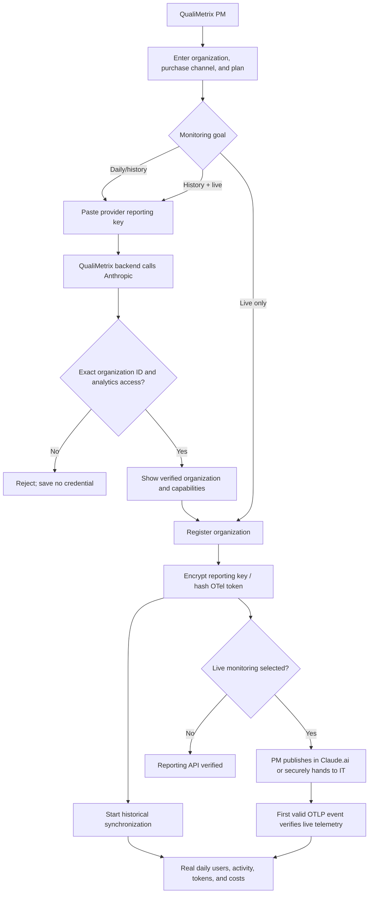

# Enterprise AI provider integration architecture

Status: implementation baseline  
Owner: QualiMetrix platform team  
Last updated: 2026-08-21

## 1. Decision

QualiMetrix integrates AI tools at the customer-organization level. A tenant Program Manager (PM) connects one or more provider organizations/accounts; developers do not register a QualiMetrix integration or paste personal monitoring tokens.

The provider subscription is purchased and administered outside QualiMetrix. QualiMetrix never creates a provider organization, buys seats, assigns licenses, or impersonates the provider's billing console. It connects to the organization/account the PM already controls and collects only the signals available through that organization's actual plan and acquisition channel.

There is no universal "Claude API" that returns every kind of usage. Collection is capability-based:

1. Official organization analytics/reporting APIs are preferred when the plan exposes them.
2. Centrally managed Claude Code OpenTelemetry (OTel) is used for detailed CLI/IDE activity and for plans/channels without a suitable organization analytics API.
3. Cloud-provider billing/monitoring APIs are authoritative when Claude is purchased through AWS, Google Cloud, Microsoft, or another gateway.
4. Hybrid connections combine provider billing with OTel activity and de-duplicate overlapping measurements.

No source is presented as more complete or more authoritative than it really is.

## 2. Operating model

### Actors

- QualiMetrix tenant PM: creates, tests, rotates, synchronizes, and disconnects provider connections.
- Provider owner/admin: buys the plan, creates provider-side reporting credentials, and applies centralized settings where the provider requires it. This can be the same person as the QualiMetrix PM, but does not have to be.
- Developer/tester: uses Claude Code normally. They do not connect QualiMetrix and do not receive a QualiMetrix login merely because telemetry mentions their email.
- IT/MDM: optional delivery channel for endpoint-managed settings when server-managed settings are unavailable or unsuitable.

### Connection lifecycle

`created -> awaiting_configuration/awaiting_telemetry -> connected -> error/reauth_required -> disconnected`

- API-only connection: validate the reporting credential before saving it; a successful validation starts scheduled synchronization.
- OTel connection: return the generated managed-settings JSON and secret once. The connection becomes `connected` only after valid telemetry arrives.
- Hybrid connection: validate the API credential and wait for telemetry. The status exposes which capabilities are active.
- Reconnect/rotation issues a new credential or telemetry token and immediately revokes the old value.
- Disconnect is tenant-scoped, stops collection/sync, and preserves already-collected records under retention policy.

### Nontechnical PM deployment paths

The PM never runs JSON or asks developers to configure QualiMetrix. After a managed-OTel connection is created, QualiMetrix presents two explicit paths:

1. **PM is also a Claude Admin/Owner:** QualiMetrix provides guided steps and a one-click copy action. The PM signs in to Claude.ai, opens **Admin Settings → Claude Code → Managed settings**, pastes the exact settings object, and saves it.
2. **PM is not a Claude Admin/Owner:** QualiMetrix creates a one-time `managed-settings.json` download plus secret-free handoff instructions. The PM transfers the file only through the organization's approved secret-sharing mechanism. Claude Admin/IT deploys it using Claude server-managed settings, MDM/OS policy, or a system managed-settings file.

The deployment credential exists in the browser only for that creation/rotation response. QualiMetrix stores its SHA-256 hash, not the readable token. Refreshing the page removes the readable copy; generating another package rotates and immediately revokes the old token.

### PM onboarding and verification flow



The organization record, reporting API, and live telemetry have separate verification states. Entering an organization ID registers only a tenant-scoped record; it does not prove provider ownership and cannot pull logs by itself. A connection is never labelled fully verified until every selected data path has passed its own provider or ingestion check.

## 3. Claude/Anthropic capability matrix

| Acquisition channel            | Typical plan             | Official reporting source                                                        | Detailed Claude Code activity                                               | Billing authority                                    | QualiMetrix mode                                                |
| ------------------------------ | ------------------------ | -------------------------------------------------------------------------------- | --------------------------------------------------------------------------- | ---------------------------------------------------- | --------------------------------------------------------------- |
| Anthropic direct (`claude.ai`) | Team                     | Provider dashboard where available; no assumption of an Enterprise Analytics key | Centrally managed OTel                                                      | Provider invoice/dashboard                           | Managed OTel; add API capability only when provider verifies it |
| Anthropic direct (`claude.ai`) | Enterprise               | Enterprise Analytics API                                                         | Enterprise activity API plus managed OTel when detailed events are required | Enterprise cost report                               | Enterprise API or hybrid                                        |
| Anthropic Console / Claude API | Console organization     | Claude Code Analytics API and Usage/Cost Admin API                               | Claude Code Analytics API plus optional OTel                                | Console reporting API                                | Console API or hybrid                                           |
| Amazon Bedrock                 | Enterprise cloud account | AWS Cost Explorer/CUR/CloudWatch/Bedrock telemetry                               | Managed OTel                                                                | AWS billing                                          | Managed OTel + AWS adapter (future connector)                   |
| Google Vertex AI               | Enterprise cloud project | Cloud Billing export/Cloud Monitoring/Vertex audit data                          | Managed OTel                                                                | Google Cloud billing                                 | Managed OTel + GCP adapter (future connector)                   |
| Microsoft Foundry              | Enterprise cloud account | Azure Cost Management/Monitor/provider diagnostics                               | Managed OTel                                                                | Azure billing                                        | Managed OTel + Azure adapter (future connector)                 |
| Enterprise AI gateway          | Any underlying provider  | Gateway usage/billing API or logs                                                | Gateway logs and/or managed OTel                                            | Gateway or underlying invoice, configured explicitly | Gateway adapter + optional OTel                                 |

Important limitations:

- Anthropic's Claude Code Analytics API reports Claude Code usage on the Claude API; it does not include usage routed through Bedrock, Foundry, Vertex, or Claude Platform on AWS.
- OTel cost metrics are estimates. Provider/cloud billed cost overrides estimated cost; both are retained with different labels.
- Team, Enterprise, and Console are not treated as interchangeable credential types.
- OTel begins when managed settings are active; it cannot reconstruct history from before deployment.

Primary references:

- [Claude Code monitoring and OTel](https://code.claude.com/docs/en/monitoring-usage)
- [Claude Code organization setup](https://code.claude.com/docs/en/admin-setup)
- [Claude Code Analytics API](https://platform.claude.com/docs/en/manage-claude/claude-code-analytics-api)
- [Claude Code usage report API](https://platform.claude.com/docs/en/api/admin/usage_report)
- [Anthropic Usage and Cost API](https://platform.claude.com/docs/en/manage-claude/usage-cost-api)
- [Enterprise per-user activity](https://platform.claude.com/docs/en/api/admin/analytics/users/list)
- [Enterprise cost report](https://platform.claude.com/docs/en/api/admin/analytics/cost)
- [Team and Enterprise Claude Code access](https://support.claude.com/en/articles/11845131-use-claude-code-with-your-team-or-enterprise-plan)

Provider documentation changes over time. Capability validation at connection time and contract tests are authoritative over this table.

## 4. Claude connection inputs

The PM supplies:

- display name for the provider organization;
- provider organization/account ID (not a fabricated QualiMetrix ID);
- optional verified email domain;
- plan type: Team, Enterprise, Console API, or custom;
- acquisition channel: Anthropic direct, Anthropic Console, Bedrock, Vertex, Foundry, or gateway;
- monitoring goal in business terms: daily/history, near-real-time, or complete monitoring;
- the provider-issued reporting key when daily/history is selected.

The PM does not select technical adapters. QualiMetrix derives `managed_otel`, `enterprise_analytics`, `console_analytics`, or `hybrid` from the plan, acquisition channel, monitoring goal, and verified key type.

### Reporting key matrix

| Provider organization                                                       | Key the PM supplies                           | Created by                  | Created in                              | Validation performed before save                                                                         |
| --------------------------------------------------------------------------- | --------------------------------------------- | --------------------------- | --------------------------------------- | -------------------------------------------------------------------------------------------------------- |
| Claude Enterprise (`claude.ai`)                                             | Analytics API key with `read:analytics`       | Primary Owner               | Claude.ai → Organization settings → API | Enterprise per-user usage returns the entered organization ID and the user-activity endpoint is readable |
| Claude Platform / Console organization                                      | Admin API key (`sk-ant-admin...`)             | Organization admin          | Claude Console → Settings → Admin keys  | `/v1/organizations/me` returns the entered organization ID and the Claude Code usage report is readable  |
| Team/subscription usage exposed through the Claude Code Analytics Admin API | Admin API key                                 | Organization admin          | Claude Console → Settings → Admin keys  | Same two Console checks; support is accepted only when Anthropic proves the capability                   |
| Bedrock, Vertex, Foundry, gateway                                           | Cloud/gateway credential in its own connector | Cloud/gateway administrator | Respective provider                     | Not accepted by this Anthropic reporting-key form                                                        |

An ordinary model API key is not a reporting credential. Analytics and Admin API keys are not interchangeable. The Settings page links the PM to the official Anthropic key location and does not ask the PM or a developer to use a terminal.

QualiMetrix permits multiple Anthropic organizations per tenant. The uniqueness boundary is tenant + vendor + acquisition channel + external account ID.

### Credential handling

- Reporting credentials are encrypted at rest using the platform encryption service.
- Secret values are never returned after creation and never appear in list/status responses or logs.
- OTel tokens are random, connection-specific, stored only as SHA-256 hashes, and returned once as part of the managed settings.
- Credential validation uses the least-privilege official reporting endpoint.
- Credential discovery is non-persistent: an invalid key, wrong organization ID, wrong key family, or insufficient analytics access saves nothing.
- API errors are sanitized before storage or display.
- Every mutation is PM-only and tenant-scoped.

## 5. Managed OTel delivery

QualiMetrix generates a `managed-settings.json` fragment. For supported Team/Enterprise clients, the provider owner can place it in Claude's server-managed settings; otherwise IT deploys the same settings through MDM/configuration management. Developers do not edit personal files.

### Trusted public endpoint requirement

Production must set the server-only environment variable below to the HTTPS API base address reachable from employee devices:

```text
QUALIMETRIX_PUBLIC_API_URL=https://api.qualimetrix.example.com
```

QualiMetrix does not trust the request `Host` header when classifying an organization package as enterprise-ready. A package is enterprise-ready only when the explicit configuration is HTTPS and non-local. `localhost`, `127.0.0.1`, and `::1` are marked **local test only**; the Claude Admin copy action and IT download action remain blocked. In production, creating or rotating a managed-OTel credential fails closed until the trusted URL is configured.

After deployment, the connection remains `awaiting_telemetry`. Only a valid non-empty OTLP payload can transition it to `connected`; a PM cannot self-attest successful deployment.

Generated settings enable both logs and metrics using OTLP HTTP/JSON and connection-specific endpoints:

```text
POST /api/v1/ai-usage/otlp/{connectionId}/logs
POST /api/v1/ai-usage/otlp/{connectionId}/metrics
x-qualimetrix-connection-token: <one-time secret>
```

The settings also send `qualimetrix.tenant_id` and `qualimetrix.connection_id` as resource attributes. QualiMetrix verifies the route ID, secret, tenant, resource attributes, and—when supplied by Anthropic—`organization.id`.

Privacy defaults:

- user prompt logging disabled;
- tool input/argument logging disabled;
- file contents and code snippets not collected;
- sensitive keys removed again by server-side allowlist/redaction;
- raw sanitized events retained for 90 days by default;
- normalized events retained for 24 months by default;
- aggregates retained for 7 years by default.

Retention and residency are tenant policy fields in a later governance phase. These are safe operational defaults, not a substitute for customer legal approval.

## 6. Data model and provenance

### `AiProviderConnection`

Tenant-owned connection metadata, acquisition channel, plan, capabilities, encrypted API credential, hashed OTel token, sync cursor, validation/sync/telemetry timestamps, and health status.

### `AiProviderIdentity`

An identity observed from a provider API or OTel (`user.account_uuid`, provider user ID, email, API-key actor). It is not a login account. If a matching active QualiMetrix user already exists in the same tenant, the identity may point to that user. Unmatched identities remain visible and attributable without creating employees in QualiMetrix.

### `AiProviderRawEvent`

An idempotent, sanitized source record with source, external event ID, occurrence/receipt time, optional session, schema version, and processing result. It supports replay and source audits without storing prompts/code.

### `AiProviderDailyActivity`

Provider-reported daily sessions, commits, pull requests, line counts, requests, and tool decision metrics per observed identity. It preserves exactly what the provider reports.

### `AiUsageEvent`

Normalized model/token/request/cost facts. New provenance fields identify connection, identity, source, external event ID, session, provider-billed cost, estimated cost, and metadata. `userId`, activity, sprint, latency, acceptance, and rework are nullable because unknown is not zero/false and must never be fabricated.

Idempotency keys are semantic provider keys, not ingestion-time payload hashes:

- raw: connection + source + provider event ID;
- normalized: connection + source + provider event ID;
- daily: connection + identity + UTC date + product + source.

The latest provider version updates an existing record, allowing lagging analytics data and billed cost to be reconciled without double counting.

## 7. API synchronization

### Enterprise Analytics

For each day in the incremental window, the connector obtains:

- per-user activity;
- per-user usage grouped by Claude Code product and model;
- per-user provider-billed cost grouped by product/model.

The first synchronization backfills 30 days. Subsequent runs overlap the last two days so late provider revisions are captured. Data is paginated, upserted idempotently, and cursor advancement occurs only after the whole window succeeds.

### Console Analytics

The connector downloads the Claude Code daily usage report, including user/API-key actors, sessions, commits, PRs, line changes, model token breakdown, estimated cost, and tool actions. Console-reported cost is stored as `provider_estimated`, not billed cost.

### Sync behavior

- default API polling interval: 60 minutes;
- one active sync per connection within a process;
- 401/403 -> `reauth_required`;
- throttling/transient provider error -> keep cursor, record sanitized error, retry on next schedule;
- organization ID mismatch -> fail closed;
- unsupported channel/mode combinations -> reject at connection creation.

## 8. Time, teams, products, repositories, and work items

Provider collection is the factual base layer. It does not invent project attribution.

- Every fact keeps an exact UTC timestamp/date.
- Day, month, quarter, sprint, and project-period views are derived from timestamps and real QualiMetrix sprint/project dates.
- Team membership is joined from the effective organizational membership at the time of analysis.
- Product/repository/work-item attribution is added by correlation with GitHub, Jira/Azure DevOps, and CI/test facts using identity, repository, branch/commit/PR, work-item keys, and time windows.
- An event without enough evidence remains `unattributed`; it is never assigned to a sample sprint, product, repository, or work item.

This connector establishes provider usage provenance. Cross-system outcome correlation remains the next implementation phase and must retain links and confidence/evidence for every attribution.

## 9. PM API surface

All administrative endpoints require a PM/admin session and derive tenant/user from the authenticated session:

```text
GET    /api/v1/integrations/anthropic/connections
GET    /api/v1/integrations/anthropic/deployment-readiness
POST   /api/v1/integrations/anthropic/discover
POST   /api/v1/integrations/anthropic/connections
GET    /api/v1/integrations/anthropic/connections/:id/identities
POST   /api/v1/integrations/anthropic/connections/:id/reporting-credential
POST   /api/v1/integrations/anthropic/connections/:id/rotate-telemetry-token
POST   /api/v1/integrations/anthropic/connections/:id/sync
DELETE /api/v1/integrations/anthropic/connections/:id
```

Machine ingestion uses only the connection-token endpoints documented in section 5.

## 10. Acceptance criteria

### Organization ownership and security

- [ ] A PM can register two Anthropic organizations under one QualiMetrix tenant.
- [ ] A PM from another tenant cannot view, rotate, sync, or disconnect either connection.
- [ ] Invalid plan/channel/mode combinations are rejected with a useful explanation.
- [ ] The PM chooses a monitoring goal; technical collection-mode names are not exposed as business decisions.
- [ ] The Settings page links to the correct official key location for the selected organization type.
- [ ] Key discovery displays only the verified organization ID/name, key type, and capabilities; it never returns the secret.
- [ ] An API credential is verified with an official reporting endpoint before the connection is marked connected.
- [ ] A credential with the wrong provider organization ID fails closed.
- [ ] An invalid, wrong-family, or insufficient-scope key saves no credential or partial connection.
- [ ] An already-registered organization returns a conflict and directs the PM to its existing record instead of reporting a generic connection failure.
- [ ] A PM can add or replace a verified reporting key on an existing OTel-only organization.
- [ ] API credentials are encrypted at rest and absent from every read response/log.
- [ ] OTel secrets are hashed at rest, shown only on create/rotate, and rotation immediately invalidates the old token.

### Collection truthfulness

- [ ] Team managed OTel works without any developer QualiMetrix registration.
- [ ] Direct Enterprise API sync stores real provider dates, users, model usage, activity, and provider-billed cost.
- [ ] Console Analytics sync stores real daily activity/model data and labels reported cost as estimated.
- [ ] Bedrock/Vertex/Foundry/gateway connections can use managed OTel without being mislabeled as direct Anthropic billing.
- [ ] Unknown activity, sprint, acceptance, rework, latency, product, repository, and work item remain null/unattributed.
- [ ] Re-sending the same OTel record or re-running an overlapping API window does not double count.
- [ ] Provider-billed cost wins over calculated/estimated cost while both values remain auditable.

### Identity and privacy

- [ ] Provider users appear as observed identities even if they have never signed in to QualiMetrix.
- [ ] No QualiMetrix login user is auto-created from telemetry.
- [ ] An observed email maps only to an existing user in the same tenant.
- [ ] Prompt text, code/file content, and tool arguments are disabled at the source and removed by the receiver.
- [ ] Payloads over the configured body limit are rejected.

### Operations

- [ ] Connection status distinguishes waiting for telemetry, connected, error, reauthentication required, and disconnected.
- [ ] Registration, reporting API verification, and live telemetry verification are displayed independently.
- [ ] Last validation, last telemetry, last sync, and sanitized last error are visible to the PM.
- [ ] Initial API sync backfills 30 days; later syncs overlap two days and paginate fully.
- [ ] Partial failures do not advance the cursor.
- [ ] Raw, normalized, and aggregate retention jobs follow the tenant policy (defaults: 90 days/24 months/7 years).
- [ ] Unit tests cover OTel extraction/redaction/idempotency and provider report normalization; integration tests cover tenancy and credential rotation.

## 11. Rollout sequence

1. Land schema, tenant-owned connection APIs, encrypted credentials, and hashed OTel connection tokens.
2. Replace the Claude personal-connect UI with the existing Settings-page PM organization panel.
3. Enable managed OTel logs/metrics ingestion and verify with captured real Claude Code payloads.
4. Enable Enterprise and Console API synchronization behind capability flags and reconcile billed/estimated cost.
5. Add dashboards for connection health and observed identity mapping using the existing UI system.
6. Implement AWS/GCP/Azure/gateway billing adapters as separate acquisition-channel connectors.
7. Correlate provider facts to real GitHub, Jira/ADO, CI/test, team, sprint, and project facts with evidence and confidence.

## 12. Explicit non-goals for this connector

- purchasing an AI plan or seats;
- creating or editing the provider's organization/member roster;
- collecting prompts, generated code, or tool arguments by default;
- claiming causal productivity improvement from usage alone;
- treating token volume, commits, or lines changed as productivity without outcome correlation;
- silently filling missing data with mocks, sample sprints, or inferred success.
